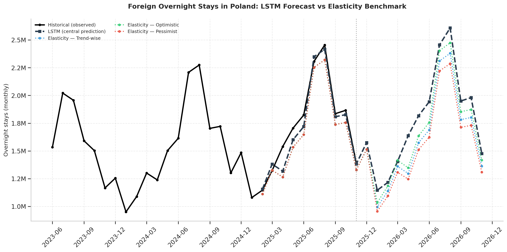
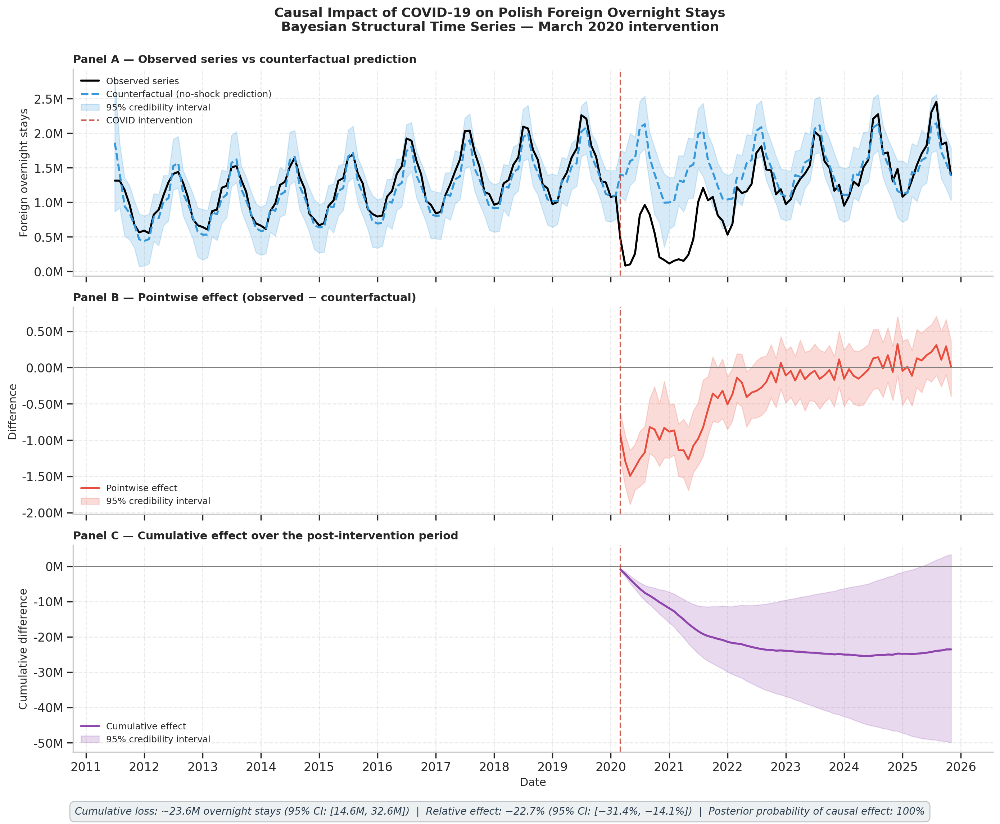

# Macro-Aviation-Tourism Modelling — Forecasting Tourism Demand in Poland

> **Bachelor's Thesis** — Data Science and Engineering, Universidad de Las Palmas de Gran Canaria (ULPGC).  
> Author: **Diego Marrero Ferrera**  · Supervisor: **Juan María Hernández Guerra** (ULPGC).  
> External advisor: **Samuel Ferrera Falcón** (senior economist with industry experience in the European low-cost aviation sector).


*Parallel growth of air connectivity and real GDP per capita of Poland since EU accession (2004–2024). The COVID-19 shock is clearly visible. This is the central macroeconomic narrative the project aims to model formally.*


A reproducible pipeline that integrates macroeconomic, demographic and air-connectivity data to **model and forecast inbound tourism demand in Poland**. The project compares classical econometrics, machine learning and recurrent deep learning over a common evaluation protocol, addresses air-capacity endogeneity through a four-specification scheme, performs a Bayesian causal analysis of the COVID-19 shock, and delivers two operationally usable artefacts: a scenario-conditional forecasting pipeline driven by IMF projections, and an interpretable airline capacity model designed for use by industry practitioners.

---

## 1. Motivation

Poland's international tourism has expanded by roughly an order of magnitude in passenger volume since EU accession in 2004, driven by a parallel doubling of real GDP per capita and an aggressive penetration of low-cost carriers — primarily Ryanair and Wizz Air — that have reshaped the country's air connectivity. The COVID-19 shock created a clean structural break in the series and presents a non-trivial forecasting challenge that classical methods struggle with. This thesis develops a comparative framework to determine which modelling paradigm — and which methodological choices — produce the most reliable forecasts in this setting.

## 2. Key contributions

The work makes six contributions of methodological and applied interest:

1. **Integrated monthly panel (179 observations, 2011–2025)** combining Eurostat, ONS (UK) and IMF sources, with the UK series reconnected through statistical chain-linking after Brexit.
2. **Four-specification comparative scheme (M1–M4)** that quantifies empirically the cost of progressively addressing endogeneity and removing autoregressive shortcuts in machine-learning models.
3. **Year-over-year target reformulation in the LSTM**, which produces a 42 %–83 % improvement in MAPE relative to the levels formulation by neutralising the COVID-induced structural break — a methodological choice not documented systematically in the tourism forecasting literature consulted.
4. **Explicit distinction between academic and operational specifications** of the same model, quantifying the precision cost of using only information available at decision time.
5. **Bayesian causal analysis of the COVID-19 impact** via `CausalImpact` and BSTS models, estimating the counterfactual loss of overnight stays in Poland between March 2020 and November 2025.
6. **Two applied deliverables for industry use**: a scenario-conditional pipeline driven by IMF World Economic Outlook projections, and an interpretable airline capacity model with a closed-form formula ready to be incorporated in operational planning.

## 3. Best-performing model

The winning model on the 12-month hold-out is **LSTM-direct12 V2** (year-over-year target), with MAPE = **4.36 %**, beating the SARIMA baseline (6.0 %) and the gradient-boosted trees (5.83 % – 7.6 %). On the post-COVID rolling-window backtest at horizon 12, the same model achieves **3.33 % MAPE**, roughly half that of XGBoost.

## 4. Repository structure

```
Macro-Aviation-Tourism-Modeling/
│
|-── data/
│   |-── raw/                Original datasets from Eurostat, ONS and IMF.
│   │   |-── demographic/    Population (demo_pjan) and consumer confidence (ei_bsco_m).
│   │   |-── economic/       HICP, PPP, exchange rates, GDP (nominal and real), IMF WEO.
│   │   |-── tourism/        Overnight stays, infrastructure, employment, UN Tourism arrivals.
│   │   |-── transport/      Air passengers (avia_paoc, avia_tf_aca, avia_tf_apal).
│   │   |-── uk_specific/    ONS series for UK chain-linking (D7BT, ABMI, UKPOP).
│   |-── processed/          Consolidated master panel and intermediate outputs.
│
|-── docs/                   **Project's main development directory.**
│   |-── 00_data_loading_inspection.ipynb     NB00 — Load and harmonise all sources.
│   |-── 01_eda_descriptive_statistics.ipynb  NB01 — Univariate analysis of the target.
│   |-── 02_multivariate_eda_correlations.ipynb NB02 — Cross-correlations and CCF analysis.
│   |-── 03_statistical_tests_feature_selection.ipynb  NB03 — ADF, KPSS, Granger, cointegration tests.
│   |-── 04_feature_engineering.ipynb         NB04 — Lagged variables, dummies, VIF diagnosis.
│   |-── 05_baseline_models.ipynb             NB05 — Naive, Holt-Winters, SARIMA, SARIMAX.
│   |-── 06_ml_models.ipynb                   NB06 — Random Forest and XGBoost (4 specs).
│   |-── 07_lstm_deep_learning.ipynb          NB07 — LSTM variants and permutation importance.
│   |-── 08_imf_capacity_forecasting.ipynb    NB08 — IMF scenarios + CausalImpact analysis.
│   |-── 09_seats_forecast.ipynb              NB09 — Applied capacity model for industry use.
│
|-── figures/                Generated figures, one subfolder per notebook.
│
|-── schemas/                Pitch deck and early conceptual diagrams.
│
|-── documentation_es/       Auxiliary working directory with the thesis manuscript draft
│                           in Spanish (for personal use; not part of the public artefact).
│
|-── README.md               This file.
```

## 5. The nine notebooks: an analytical pipeline

The project follows the **CRISP-DM methodology** mapped onto nine sequential notebooks. Each is self-contained and reproducible from `data/raw/`.

| Notebook | Phase | Purpose |
|---|---|---|
| **NB00** | Data understanding | Load and structurally validate all raw datasets. Build the per-country wide tables for HICP, GDP, population and consumer confidence. Apply chain-linking to UK series. |
| **NB01** | EDA univariate | Characterise the target series (foreign overnight stays in Poland) — trend, seasonality, COVID disruption. |
| **NB02** | EDA multivariate | Compute cross-correlations between target and predictors at lags 0–12 months, in levels and in year-over-year transformations. |
| **NB03** | Statistical tests | Formal tests of stationarity (ADF, KPSS), Granger causality and Engle-Granger cointegration. Identifies the bidirectional endogeneity of air capacity. |
| **NB04** | Feature engineering | Build lagged variables, COVID dummies, derived variables. Diagnose collinearity via VIF on first differences. Produce the consolidated panel. |
| **NB05** | Baselines | Naive Seasonal, Holt-Winters, SARIMA, SARIMAX evaluated on a 12-month hold-out. Reveals the apparent (but degenerate) Holt-Winters success and the SARIMAX inferiority over SARIMA. |
| **NB06** | Machine Learning | Random Forest and XGBoost in four specifications (M1–M4) of decreasing complexity, quantifying the cost of removing autoregressive shortcuts. |
| **NB07** | Deep Learning | LSTM-1step and LSTM-direct12 in two formulations (levels and YoY), plus permutation importance of the winning model. Discovers the year-over-year reformulation as central methodological contribution. |
| **NB08** | Scenarios + Causal | Forward-looking forecasts under IMF scenarios (Trend-wise, Optimistic, Pessimistic) and Bayesian causal analysis of the COVID-19 impact via CausalImpact. |
| **NB09** | Applied model | Two parallel airline capacity models (interpretable OLS log-log and XGBoost), with closed-form formula for industry use. |

## 6. Headline results


*Central LSTM forecast (winning model) combined with the elasticity benchmark of Peng et al. (2015) under the three IMF World Economic Outlook scenarios for 2025–2026.*


| Model | MAPE on hold-out | Notes |
|---|---:|---|
| **LSTM-direct12 V2 (YoY)** | **4.36 %** | Best model; selected as winner. |
| LSTM-1step V2 (YoY) | 4.71 % | |
| XGB-noCOVID | 5.83 % | |
| SARIMA(1,1,1)(1,1,1)₁₂ | 6.00 % | Best classical baseline. |
| SARIMAX(1,1,1)(1,1,1)₁₂ | 6.60 % | |
| RF M1-Full | 8.20 % | |
| Naive Seasonal | 9.10 % | Trivial baseline. |
| Holt-Winters | 3.90 % | Numerically degenerate (α=1, β=γ=0). Not robust. |

### Causal analysis of the COVID-19 shock


*Counterfactual analysis of the COVID-19 impact on Polish foreign overnight stays using `CausalImpact` (Brodersen et al. 2015). Top: observed series vs. Bayesian counterfactual (95% credibility band). Middle: pointwise effect. Bottom: cumulative effect. The estimated cumulative loss attributable to the pandemic is approximately 23.6 million overnight stays (95% CI: 14.6M – 32.6M).*


Additional findings reported in the thesis: estimated counterfactual loss of **23.6 million overnight stays** due to COVID-19 (95 % CI: 14.6M–32.6M), GDP-elasticity of airline capacity estimated at **1.57** (in line with the 1.5–2.5 literature range).

## 7. Setup and reproducibility

### Requirements

- Python 3.10+
- Core libraries: `pandas`, `numpy`, `scikit-learn`, `statsmodels`, `xgboost`, `tensorflow >= 2.10`, `matplotlib`, `seaborn`, `scipy`, `pycausalimpact`, `scikit-optimize`.

A `requirements.txt` is provided. Install with:

```bash
pip install -r requirements.txt
```

For GPU-accelerated training of the LSTM (NB07) on Windows, the recommended setup is WSL2 + Ubuntu 22.04 + Python 3.10 + CUDA via the official NVIDIA pip packages. TensorFlow does not officially support Python 3.12 on Windows native.

### Running the pipeline

The notebooks are designed to run **sequentially** from NB00 to NB09. Each notebook reads from `data/raw/` and from intermediate outputs of previous notebooks in `data/processed/`. Re-running the full pipeline from scratch takes approximately 30–45 minutes on a CPU and around 10–15 minutes on a CUDA-enabled GPU (NB07 is the bottleneck).

```bash
jupyter lab docs/
```

## 8. Primary data sources

All datasets are open and publicly accessible.

- **Eurostat**: `tour_occ_nights`, `tour_cap_nat`, `tour_lfsq6r2`, `avia_paoc`, `avia_tf_aca`, `avia_tf_apal`, `prc_hicp_midx`, `prc_hicp_aind`, `prc_ppp_ind`, `ert_bil_eur_m`, `namq_10_gdp`, `demo_pjan`, `ei_bsco_m`. https://ec.europa.eu/eurostat/
- **Office for National Statistics (UK)**: Series D7BT (HICP CPIH), ABMI (GDP at constant prices), UKPOP (population estimates). https://www.ons.gov.uk/
- **International Monetary Fund**: World Economic Outlook database, April 2025 release. https://www.imf.org/external/datamapper/datasets
- **UN Tourism (UNWTO)**: international tourism inbound arrivals and expenditure (December 2025 release). https://www.unwto.org/
- **Our World in Data**: GDP by world regions (used for global contextualisation). https://ourworldindata.org/

## 9. Methodology in brief

The project follows the **CRISP-DM standard**, with cross-validation by expanding-window backtesting and formal model comparison via the **Diebold-Mariano test** with the Harvey-Leybourne-Newbold small-sample correction. Multicollinearity is diagnosed on first differences (the reliable VIF for trending series). Air capacity endogeneity is addressed by removing the contemporary `seats` variable and using `seats_lag6` instead, predetermined by the IATA slot allocation horizon. The structural COVID-19 break is handled architecturally: tree-based models use explicit dummies; LSTMs exclude the COVID window from training and operate on a year-over-year target ratio that absorbs the structural level shift into the denominator.

## 10. Selected bibliography

- Athanasopoulos, G., Hyndman, R. J., Song, H., Wu, D. C. (2011). The tourism forecasting competition. *International Journal of Forecasting*, 27(3), 822–844.
- Box, G. E. P., Jenkins, G. M. (1976). *Time Series Analysis: Forecasting and Control*. Holden-Day.
- Brodersen, K. H., Gallusser, F., Koehler, J., Remy, N., Scott, S. L. (2015). Inferring causal impact using Bayesian structural time-series models. *The Annals of Applied Statistics*, 9(1), 247–274.
- Chen, T., Guestrin, C. (2016). XGBoost: A scalable tree boosting system. *KDD '16*, 785–794.
- Diebold, F. X., Mariano, R. S. (1995). Comparing predictive accuracy. *Journal of Business & Economic Statistics*, 13(3), 253–263.
- Fisher, A., Rudin, C., Dominici, F. (2019). All Models are Wrong, but Many are Useful. *Journal of Machine Learning Research*, 20(177), 1–81.
- Hochreiter, S., Schmidhuber, J. (1997). Long Short-Term Memory. *Neural Computation*, 9(8), 1735–1780.
- Peng, B., Song, H., Crouch, G. I., Witt, S. F. (2015). A meta-analysis of international tourism demand elasticities. *Journal of Travel Research*, 54(5), 611–633.
- Salamanis, A., Xanthopoulou, G., Kehagias, D., Tzovaras, D. (2022). LSTM-Based Deep Learning Models for Long-Term Tourism Demand Forecasting. *Electronics*, 11(22), 3681.
- Song, H., Witt, S. F., Li, G. (2009). *The Advanced Econometrics of Tourism Demand*. Routledge.

A complete bibliography is included in the thesis manuscript.

## 11. License and citation

This work is released under the **MIT License**. If you find this work useful for your own research, please cite it as:

> Marrero Ferrera, D. (2026). *Modelling and forecasting tourism demand in Poland in European Touristic Flows*. Bachelor's Thesis, Universidad de Las Palmas de Gran Canaria, Escuela de Ingeniería Informática.

## 12. Contact

Questions, suggestions or collaboration proposals welcome. Open an issue on this repository or contact me through the email: `dmarreroferrera@gmail.com`.

---

*This repository accompanies a Bachelor's Thesis defended in 2026 at ULPGC. The code is provided for academic and educational purposes.*
