# Análisis y Modelización del Impacto del Crecimiento Aéreo y Económico de Polonia en los Flujos Turísticos Europeos
# Versión borrador 2.3 02-06

**Trabajo de Fin de Grado — Grado en Ciencia e Ingeniería de Datos**

**Autor:** Diego Marrero Ferrera

**Tutores:** Académico: Juan María Hernández Guerra. Externo: Samuel Ferrera Falcón.

**Universidad de Las Palmas de Gran Canaria — Escuela de Ingeniería Informática**
**Curso 2025–2026**

---

> *Nota de maquetación: La conversión final a la plantilla LaTeX de la EII se realizará al cierre del trabajo. Los marcadores del tipo `[ILUSTRACIÓN X.Y AQUÍ]` indican la posición y el contenido de cada figura, que se insertará en el `\includegraphics` correspondiente. la plantilla EII tiene la estructura: 1 Introducción, 2 Estado actual y objetivos iniciales, 3 Aportaciones del trabajo, 4 Desarrollo, 5 Resultados, 6 Conclusiones y trabajo futuro.*

---

## Resumen

Este Trabajo de Fin de Grado modeliza y predice la demanda turística internacional en Polonia mediante una metodología de complejidad progresiva. Integrando variables macroeconómicas, demográficas y de conectividad aérea procedentes principalmente de Eurostat y del Fondo Monetario Internacional, se construye una batería comparativa de modelos predictivos que abarca series temporales clásicas (SARIMA, SARIMAX), aprendizaje automático (Random Forest, XGBoost) y aprendizaje profundo recurrente (LSTM con variables exógenas). Tras abordar de forma sistemática el problema de endogeneidad de la capacidad aérea, los modelos se evalúan mediante validación temporal con backtest expansivo y tests formales de significación. El trabajo se completa con dos componentes aplicados: un pipeline prospectivo alimentado por proyecciones del Fondo Monetario Internacional que simula la demanda bajo escenarios económicos alternativos, y un análisis causal del impacto del COVID-19 mediante series temporales estructurales bayesianas. El resultado es una herramienta integrada de planificación estratégica con utilidad operativa para aerolíneas y gestores de destinos turísticos.

**Palabras clave:** demanda turística, predicción de series temporales, Polonia, LSTM, SARIMAX, XGBoost, estadística bayesiana, Eurostat, conectividad aérea, COVID-19, escenarios FMI.


---

## Abstract

This Bachelor's Thesis models and forecasts international tourism demand in Poland through a methodology of progressive complexity. By integrating macroeconomic, demographic and air connectivity variables mainly from Eurostat and from the International Monetary Fund, the work develops a comparative battery of predictive models spanning classical time series (SARIMA, SARIMAX), machine learning (Random Forest, XGBoost) and recurrent deep learning (LSTM with exogenous variables). After systematically addressing the endogeneity of air capacity, the models are evaluated through temporal validation with expanding-window backtesting and formal tests of significance. The work is completed with two applied components: a forward-looking pipeline fed by International Monetary Fund projections that simulates demand under alternative economic scenarios, and a causal analysis of the COVID-19 impact using Bayesian structural time series. The result is an integrated strategic planning tool with operational value for airlines and destination managers.

**Keywords:** tourism demand, time series forecasting, Poland, LSTM, SARIMAX, XGBoost, Bayesian statistics, Eurostat, air connectivity, COVID-19, IMF scenarios.

---

# Capítulo 1. Introducción

## 1.1. El turismo internacional como fenómeno socioeconómico

El turismo internacional constituye uno de los sectores económicos más relevantes a escala global. Según el Barómetro Mundial del Turismo de la Organización Mundial del Turismo de Naciones Unidas, las llegadas internacionales alcanzaron los 1.400 millones en 2024, recuperando de forma prácticamente completa los niveles previos a la pandemia de COVID-19. El Consejo Mundial de Viajes y Turismo estimó que la contribución total del sector al Producto Interior Bruto mundial fue de 10,9 billones de dólares en 2024 — en torno al 10 % de la economía global — sosteniendo 357 millones de empleos directos e indirectos. En el ámbito europeo, el turismo aportó cerca de 1,8 billones de euros al PIB de la Unión Europea, consolidándose como uno de los motores estructurales del continente (WTTC, 2025).


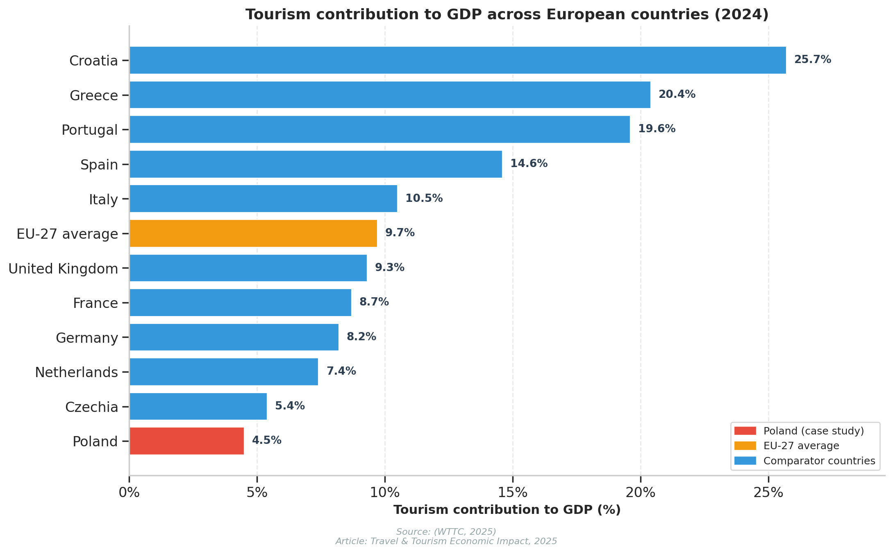
> Ilustración 1.1. Contribución del turismo al PIB en países europeos seleccionados, 2024. Fuente: WTTC (2025).


La heterogeneidad que muestra la Ilustración 1.1 refleja la diversidad estructural del turismo europeo: conviven economías intensivas en turismo — donde el sector supera el 20 % del PIB — con economías emergentes en las que el turismo representa todavía una fracción moderada de la actividad agregada. Polonia se inscribe en este segundo grupo, con un margen de crecimiento aún considerable que la hace especialmente interesante desde la perspectiva de la predicción y la planificación estratégica.

## 1.2. La importancia de predecir la demanda turística

La capacidad de anticipar la demanda turística con precisión tiene una importancia estratégica de primer orden. Los productos turísticos son intensamente perecederos: una plaza hotelera vacía una noche concreta o un asiento de avión no vendido en un vuelo determinado son ingresos perdidos de forma irrecuperable. La predicción anticipada permite mejorar la asignación de recursos escasos, condicionando la planificación de infraestructuras aeroportuarias, la programación de rutas aéreas, la gestión de la capacidad de alojamiento, el dimensionamiento de plantillas estacionales y la coordinación de toda la cadena de valor turística.

La literatura económica sitúa al turismo internacional como un bien de lujo: el meta-análisis de Peng, Song, Crouch y Witt (2015), basado en 194 estudios de elasticidades, sitúa la elasticidad-renta media en torno a 2,0, lo que confirma una alta sensibilidad de la demanda turística a las fluctuaciones macroeconómicas y, por tanto, una notable exposición del sector a los ciclos económicos y a los shocks estructurales.

Esta volatilidad quedó dramáticamente expuesta durante la pandemia de COVID-19, el mayor colapso conocido en la historia moderna del turismo internacional. Según Eurostat, las pernoctaciones de turistas extranjeros en la Unión Europea se desplomaron alrededor de un 85 % en abril de 2020 respecto al mismo mes del año anterior, y la serie tardó aproximadamente 28 meses en recuperar los niveles previos (Eurostat_a, 2025). Este episodio reforzó la necesidad de herramientas predictivas robustas, capaces de integrar no solo la dinámica temporal endógena del sector sino también los determinantes macroeconómicos, demográficos y de conectividad que condicionan los flujos turísticos.


## 1.3. Polonia como caso de estudio

Este trabajo toma como caso de estudio el turismo internacional en Polonia, una elección que responde a varios factores convergentes. Desde su adhesión a la Unión Europea el 1 de mayo de 2004, Polonia ha experimentado una transformación económica y estructural sin precedentes en la Europa reciente. Su PIB real per cápita, medido en volúmenes encadenados con referencia 2010, se duplicó holgadamente en el período 2004–2024, pasando de aproximadamente 7.300 EUR a 15.750 EUR por habitante (un crecimiento de un factor 2,16)(Eurostat_b, 2025); (Eurostat_c, 2025). Su nivel de precios, medido por el Índice de Precios al Consumo Armonizado, permanece notablemente por debajo de la media comunitaria, manteniendo una ventaja competitiva considerable en paridad de poder adquisitivo de cara a los visitantes extranjeros.

> 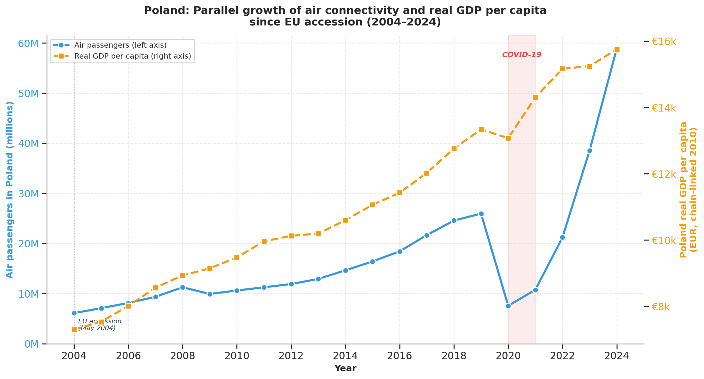
> Ilustración 1.2. Crecimiento paralelo del tráfico aéreo y del PIB real per cápita de Polonia, 2004–2024.

La Ilustración 1.2 sintetiza la narrativa macroeconómica central del trabajo: la transformación económica de Polonia ha ido acompañada de una expansión espectacular de la conectividad aérea. En el mismo período en que su PIB real per cápita se duplicaba, el número de pasajeros en aeropuertos polacos pasó de 6,1 millones en 2004 a 58,9 millones en 2024, un crecimiento de prácticamente un factor diez. Ambas curvas crecen de forma paralela y se ven afectadas simultáneamente por el shock de la pandemia en 2020, lo que sugiere una vinculación estructural entre el desempeño macroeconómico y la dinámica de la conectividad aérea que el trabajo se propone modelizar formalmente. Esta expansión ha sido impulsada en gran medida por la penetración masiva de las aerolíneas de bajo coste, particularmente Ryanair y Wizz Air, que han transformado la estructura del mercado aéreo polaco abriendo rutas directas con prácticamente todos los grandes mercados emisores de Europa Occidental.

En 2024, Polonia registró la segunda tasa de crecimiento turístico más alta de toda la Unión Europea —solo superada por Malta— con un incremento interanual cercano al 6 % en pernoctaciones internacionales. La combinación de dinamismo económico, competitividad en precios, expansión de la conectividad aérea y crecimiento turístico sostenido convierte a Polonia en un laboratorio idóneo para el análisis cuantitativo de la interacción entre variables macroeconómicas, conectividad aérea y demanda turística.


## 1.4. Objetivo general y orientación dual del trabajo

El objetivo general de este trabajo es comprender, cuantificar y predecir la interacción entre los indicadores macroeconómicos, demográficos y de conectividad aérea de Polonia y su demanda turística internacional, mediante el desarrollo de modelos predictivos de complejidad progresiva fundamentados en series temporales, aprendizaje automático, aprendizaje profundo y estadística bayesiana.

El trabajo presenta una **orientación dual** que lo distingue de la mayoría de trabajos del área. En primer lugar, posee un componente **académico**: explora sistemáticamente la aplicabilidad de métodos estadísticos y de inteligencia artificial al problema específico de la demanda turística agregada de Polonia, comparando sus prestaciones de forma rigurosa y reproducible, y documentando los problemas de endogeneidad y colinealidad que afectan a este tipo de modelos. En segundo lugar, incorpora un componente **aplicado al mercado**: el trabajo culmina en herramientas prospectivas que permiten condicionar las predicciones de demanda turística y de capacidad aérea a proyecciones macroeconómicas futuras procedentes de organismos internacionales —concretamente, el *World Economic Outlook* del Fondo Monetario Internacional— bajo escenarios alternativos.

Esta orientación aplicada no es accesoria. El trabajo incluye un módulo específico, desarrollado en diálogo con un economista del sector aéreo, orientado a la predicción de la capacidad de asientos ofertados en los aeropuertos polacos a partir de inputs macroeconómicos, con una formulación deliberadamente interpretable pensada para su uso en la planificación estratégica de una aerolínea. La distinción entre lo que es óptimo para la inferencia académica y lo que es óptimo para la decisión operativa —donde las restricciones de disponibilidad temporal de los datos y la interpretabilidad del modelo son tan importantes como la precisión— es una de las contribuciones conceptuales originales del presente trabajo, y se desarrollará en detalle en los capítulos siguientes.

## 1.5. Estructura de la memoria

El resto de la memoria se organiza conforme a la estructura de la Escuela de Ingeniería Informática. El **Capítulo 2** describe el estado actual de la modelización de demanda turística, los antecedentes metodológicos y los objetivos específicos del trabajo. El **Capítulo 3** detalla las aportaciones del trabajo, las competencias específicas del Grado en Ciencia e Ingeniería de Datos que se cubren y el alineamiento con los Objetivos de Desarrollo Sostenible. El **Capítulo 4** expone el desarrollo: la metodología CRISP-DM adoptada, la integración y el tratamiento de las fuentes de datos, la ingeniería de variables, el diagnóstico de endogeneidad y la presentación de la batería de modelos. El **Capítulo 5** presenta y discute los resultados de todos los modelos, incluyendo la comparativa rigurosa, el módulo prospectivo bajo escenarios del FMI, el análisis causal del COVID-19 y el modelo aplicado de predicción de capacidad aérea. El **Capítulo 6** recoge las conclusiones, el grado de consecución de los objetivos, las líneas de trabajo futuro y la declaración de uso de la inteligencia artificial. El documento se cierra con las referencias bibliográficas y el glosario de términos.


# Capítulo 2. Estado actual y objetivos iniciales

## 2.1. Motivación y antecedentes

### 2.1.1. Marco conceptual de la demanda turística

La modelización econométrica de la demanda turística posee una tradición consolidada que se remonta a los años setenta del siglo XX. Los trabajos de Crouch (1994, 1995) establecieron el conjunto de determinantes fundamentales que, con variaciones, ha guiado la investigación durante las tres décadas posteriores. Estos determinantes clásicos pueden agruparse en cuatro bloques.

El primer bloque lo conforman las **variables de renta de los mercados emisores**. La teoría microeconómica predice que el turismo internacional, al tratarse de un bien con elasticidad-renta superior a la unidad, debe exhibir una relación positiva y elástica con el PIB o la renta disponible de los países de origen. Los meta-análisis de Crouch (1995) y posteriormente de Peng, Song, Crouch y Witt (2015) confirman empíricamente esta predicción, con elasticidades-renta medias situadas entre 1,5 y 2,5.

El segundo bloque corresponde a los **precios relativos**. Al decidir entre destinos alternativos, los turistas comparan tanto el coste de vida relativo entre el país emisor y el receptor (inflación diferencial) como los tipos de cambio bilaterales, que determinan el poder adquisitivo efectivo de su moneda en el destino. La operacionalización más influyente del precio turístico la proporcionaron Song, Li, Witt y Fei (2010) mediante la formulación del **precio turístico relativo**:

$$P_{it} = \frac{CPI_{PL,t}}{CPI_{i,t}} \times \frac{EX_{i,t}}{EX_{PL,t}}$$

donde $CPI_{PL}$ y $CPI_i$ representan los Índices Armonizados de Precios al Consumo del destino (Polonia) y del país de origen $i$, y $EX_{PL}$ y $EX_i$ denotan los tipos de cambio bilaterales frente al euro. Esta variable captura simultáneamente el diferencial del coste de vida y el efecto de la fluctuación monetaria. Su construcción efectiva para el caso polaco se detalla en el Capítulo 4.

El tercer bloque son los **indicadores de sentimiento económico y confianza del consumidor**, de naturaleza adelantada (*leading indicators*): capturan expectativas sobre la evolución futura de la economía que anticipan las decisiones de gasto discrecional, entre ellas el turismo. El Indicador de Confianza del Consumidor publicado por la Comisión Europea constituye la referencia armonizada estándar.

El cuarto bloque, menos frecuente en la literatura clásica pero central en el presente trabajo, es el de las **variables de conectividad aérea**. La disponibilidad efectiva de asientos en vuelos directos desde los mercados emisores constituye una restricción de oferta que condiciona la demanda observada, y ha adquirido una relevancia creciente en la última década con la expansión del modelo de bajo coste en Europa.

### 2.1.2. La evolución de las aerolíneas de bajo coste en Polonia

El crecimiento turístico polaco no puede desligarse de la transformación estructural de su mercado aéreo, dominado progresivamente por las aerolíneas de bajo coste (*Low-Cost Carriers*, LCC). Estas pasaron de representar menos del 5 % del mercado polaco en 2004 a más del 52 % en 2015 (Huderek-Glapska y Nowak, 2016), y han seguido ganando cuota hasta superar el 59 % en 2023. Este fenómeno resulta de la combinación de una demanda latente considerable en las diásporas polacas en Europa Occidental —particularmente en el Reino Unido, Alemania y los Países Bajos tras las grandes olas migratorias posteriores a 2004— y de una estrategia agresiva de expansión por parte de Ryanair y Wizz Air, que establecieron bases operativas en Varsovia, Cracovia, Gdańsk y Katowice. En la Ilustración 2.1 se muestra la composición del tráfico aéreo a Polonia desglosada por los nueve principales mercados emisores, donde España, Alemania y el Reino Unido aparecen claramente como los tres mayores con cuotas en torno al 19–20 % cada uno.

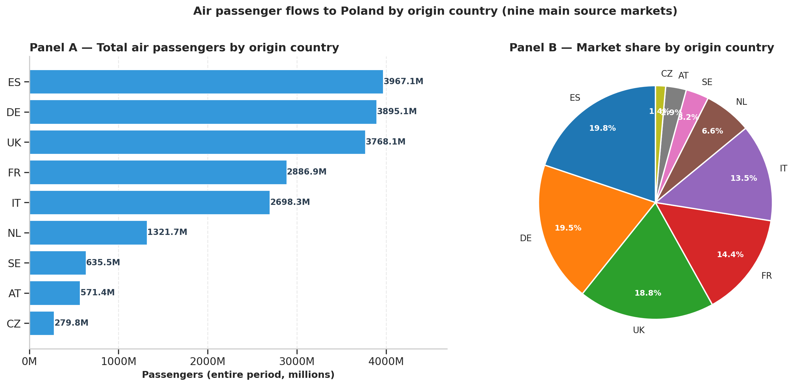
> Ilustración 2.1. Tráfico aéreo hacia Polonia por país de origen: volúmenes totales (Panel A) y cuotas de mercado (Panel B).

### 2.1.3. Pernoctaciones de turistas extranjeros como variable objetivo

La variable objetivo del trabajo son las pernoctaciones mensuales de turistas extranjeros en establecimientos de alojamiento turístico en Polonia, registradas por Eurostat en el conjunto `tour_occ_nim` (Eurostat_a, 2025) conforme al Reglamento (UE) 692/2011 sobre estadísticas europeas de turismo. La elección responde a tres consideraciones. En primer lugar, las pernoctaciones son una medida directa del impacto económico del turismo en el destino, superior a métricas alternativas como las llegadas (que no recogen la duración de la estancia) o los ingresos (sujetos a problemas de registro y armonización entre países). En segundo lugar, la frecuencia mensual permite capturar la dinámica estacional fina y la sensibilidad de corto plazo, a diferencia de las series anuales habituales, que no pueden llegar a ser lo suficientemente precisas. En tercer lugar, la armonización europea del Reglamento 692/2011 garantiza la comparabilidad y robustez de los datos. En la Ilustración 2.2 podemos observar estas pernoctaciones mensuales de turistas extranjeros en Polonia, destacando los sucesos más relevantes de los últimos años. 

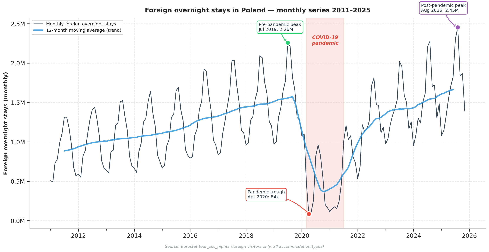
> Ilustración 2.2. Pernoctaciones mensuales de turistas extranjeros en Polonia, 2011–2025, con hitos pre-pandemia, valle COVID-19 y pico post-pandemia.

Una limitación relevante del conjunto `tour_occ_nim` (Eurostat_a, 2025) condiciona el diseño del trabajo y es necesario documentarlo de forma explícita: la variable de país de residencia solo distingue tres categorías agregadas: residentes nacionales, extranjeros y total; por lo que no proporciona desglose por país de origen. El trabajo modela, por tanto, la serie agregada de pernoctaciones extranjeras, e incorpora la dimensión de los mercados emisores a través de las variables exógenas medidas en cada país de origen, ponderadas por las cuotas de pasajeros aéreos derivadas del conjunto `avia_paoc`(Eurostat_d, 2025).

### 2.1.4. Panorama metodológico: de la econometría clásica al aprendizaje profundo

La predicción de la demanda turística ha experimentado una acelerada evolución metodológica en las dos últimas décadas. Song, Qiu y Park (2019), en una revisión de 214 estudios publicados entre 1968 y 2018, identifican tres olas sucesivas: la econometría clásica univariante (ARIMA y variantes), la econometría multivariante con variables exógenas (SARIMAX, VAR, VECM) y la ola actual de aprendizaje automático y aprendizaje profundo.

En la primera ola, los modelos de la familia ARIMA y el suavizado exponencial de Holt-Winters dominaron la práctica hasta aproximadamente 2010. Athanasopoulos, Hyndman, Song y Wu (2011), en una competición sistemática de predicción turística, documentaron que estos modelos clásicos, pese a su simplicidad, son difíciles de superar de forma consistente, especialmente en horizontes cortos y con series fuertemente estacionales.

La segunda ola incorporó variables exógenas a la estructura autorregresiva. Un hallazgo recurrente y relevante para este trabajo es el documentado por Gunter y Smeral (2016): las elasticidades estimadas mediante modelos multivariantes tienden a ser menores que las estimadas en modelos univariantes más simples. Los autores lo atribuyen al progresivo absorbimiento de la variación turística por componentes autocorrelacionados, y advierten contra la sobreinterpretación de elasticidades derivadas de modelos lineales saturados de regresores. Esta advertencia, señalada explícitamente por el tutor del presente trabajo, se confirmará empíricamente en el Capítulo 5.

La tercera ola corresponde al aprendizaje automático y profundo. Trabajos como los de Salamanis, Xanthopoulou, Kehagias y Tzovaras (2022) o Chen, Ying, Zhang y Balezentis (2024) documentan que las redes neuronales recurrentes, particularmente las arquitecturas LSTM (*Long Short-Term Memory*), pueden reducir significativamente los errores de predicción en horizontes largos cuando se dispone de suficientes datos de entrenamiento. No obstante, Hewamalage, Bergmeir y Bandara (2021), en una evaluación exhaustiva de redes recurrentes para series temporales, advierten de que estas arquitecturas son sensibles a las discontinuidades estructurales y requieren tamaños muestrales considerables; en series cortas y con cambios de régimen, los modelos clásicos y los basados en árboles suelen ser competitivos o superiores. Este matiz es central en el presente trabajo, donde la serie objetivo es relativamente corta (179 observaciones mensuales) y contiene el shock estructural del COVID-19.

Paralelamente, los métodos bayesianos han emergido como alternativa probabilística robusta para la inferencia causal. El marco *CausalImpact* desarrollado por Brodersen, Gallusser, Koehler, Remy y Scott (2015), basado en modelos bayesianos estructurales de series temporales, permite estimar el impacto causal contrafactual de una intervención exógena —como la pandemia de COVID-19— mediante la construcción de una serie sintética que estima cuál habría sido la evolución en ausencia de dicha intervención. Este enfoque se aplica en el presente trabajo para cuantificar de forma rigurosa el efecto del COVID-19 sobre el turismo polaco.

### 2.1.5. El problema de la endogeneidad de la capacidad aérea

Un problema metodológico transversal al trabajo, identificado durante el análisis exploratorio y abordado de forma sistemática, es la **endogeneidad de la capacidad aérea**. La intuición económica sugiere que el número de asientos ofertados condiciona la demanda turística observada; pero también es cierto el sentido inverso: las aerolíneas programan capacidad anticipando la demanda esperada. Existe, por tanto, una relación de causación recíproca entre capacidad y demanda. La inclusión ingenua de la capacidad aérea contemporánea como predictor de la demanda produce modelos con un ajuste aparentemente excelente pero engañoso, en los que la importancia de las variables macroeconómicas queda artificialmente enmascarada. El diagnóstico formal de esta endogeneidad —mediante tests de causalidad de Granger bidireccional— y su tratamiento mediante un esquema de especificaciones de complejidad decreciente constituyen una de las contribuciones metodológicas del trabajo, desarrollada en los Capítulos 4 y 5.

## 2.2. Objetivos

### 2.2.1. Objetivo general

El objetivo general de este trabajo es analizar y predecir la evolución del turismo internacional asociado a Polonia mediante la integración de datos económicos, demográficos y de capacidad aérea, construyendo modelos basados en series temporales, aprendizaje automático, aprendizaje profundo y estadística bayesiana, y evaluando su comportamiento comparativo bajo distintas especificaciones y horizontes de predicción.

### 2.2.2. Objetivos específicos

Los objetivos específicos previstos en la propuesta inicial se articulan en los siguientes puntos.

**Primero.** Realizar un análisis descriptivo y comparativo de la evolución de las plazas aéreas, el PIB real y nominal, la población y las principales métricas turísticas de Polonia frente a sus mercados emisores de Europa Occidental.

**Segundo.** Calcular indicadores derivados clave, tales como la propensión a viajar, las plazas aéreas per cápita, los ratios entre crecimiento económico y conectividad aérea y, particularmente, el precio turístico relativo de Song et al. (2010) ponderado por las cuotas de tráfico aéreo de los mercados emisores.

**Tercero.** Modelizar y cuantificar el impacto de cada variable —macroeconómica, demográfica y de conectividad aérea— sobre los flujos turísticos hacia Polonia, reconociendo el bucle de realimentación entre crecimiento económico, tráfico aéreo y gasto turístico que la literatura del área documenta.

**Cuarto.** Desarrollar una batería progresiva de modelos predictivos que incluya:

- Modelos clásicos: ARIMA, SARIMA y regresión con variables exógenas (SARIMAX);
- Algoritmos de aprendizaje automático: Random Forest y XGBoost;
- Modelos de aprendizaje profundo para series temporales: redes recurrentes LSTM con variables exógenas, en distintas configuraciones arquitecturales.

**Quinto.** Generar predicciones bajo escenarios alternativos —tendencial, optimista y pesimista— sobre la evolución macroeconómica de los mercados emisores y la capacidad aérea de Polonia, y evaluar su impacto sobre el turismo europeo. Este objetivo incluye explícitamente el desarrollo de un módulo de *Airline Capacity Prediction* que prediga la capacidad de asientos ofertados a partir de inputs macroeconómicos, con utilidad directa para la planificación estratégica del sector aéreo.

### 2.2.3. Desviaciones respecto a la propuesta inicial

El desarrollo del trabajo se ha ajustado sustancialmente a la propuesta inicial, manteniendo intactos los cinco objetivos específicos enunciados arriba. La desviación más relevante respecto a lo previsto es de carácter metodológico y no de alcance: el tratamiento del cambio estructural causado por el COVID-19 reveló, en una fase intermedia del trabajo, la conveniencia de adoptar una formulación del objetivo del modelo recurrente en tasa de variación interanual en lugar de niveles absolutos. Esta decisión, no anticipada en la propuesta inicial, resultó ser una de las contribuciones metodológicas más relevantes del trabajo y se desarrolla en detalle en el Capítulo 5. Adicionalmente, hayan sido determinantes por sus resultados o no, la metodología de evaluación incorporó tests formales de significación —concretamente el test de Diebold-Mariano con la corrección de Harvey-Leybourne-Newbold para muestras pequeñas— y un esquema de backtest con ventana expansiva a múltiples horizontes, refinamientos metodológicos no especificados en la propuesta inicial pero alineados con la intención de evaluar rigurosamente la batería de modelos.


# Capítulo 3. Aportaciones del trabajo

Este capítulo justifica el valor que el trabajo aporta a su entorno socioeconómico, técnico y científico, indica qué competencias específicas del Grado en Ciencia e Ingeniería de Datos se han desarrollado y discute el alineamiento del proyecto con los Objetivos de Desarrollo Sostenible.

## 3.1. Principales aportaciones

El trabajo aporta valor tanto al dominio técnico de la ciencia de datos como al análisis aplicado del sector turístico. Sus contribuciones principales se agrupan en seis ejes.

**Integración y armonización multidimensional de fuentes oficiales.** Se consolida un panel mensual maestro que resuelve deficiencias históricas de integración entre fuentes heterogéneas: Eurostat para variables turísticas, macroeconómicas y de conectividad aérea, Office for National Statistics (ONS) del Reino Unido para las series que dejaron de publicarse de forma armonizada tras el Brexit, y proyecciones del Fondo Monetario Internacional para el módulo prospectivo. El tratamiento del Reino Unido mediante encadenamiento estadístico (*chain-linking*) sobre el período de solapamiento con Eurostat es una mejora sustancial respecto a las aproximaciones habituales de extrapolación o exclusión del mercado británico, que representa cerca del 19 % del tráfico aéreo hacia Polonia.

**Comparativa multiparadigma rigurosa.** El trabajo cuantifica empíricamente el valor marginal de cuatro paradigmas metodológicos —econometría clásica, aprendizaje automático, aprendizaje profundo y estadística bayesiana— sobre un mismo problema y con un protocolo de evaluación común. A diferencia de las comparaciones superficiales basadas en un único hold-out, la evaluación combina validación cruzada temporal con backtest de ventana expansiva a múltiples horizontes y test de Diebold-Mariano con corrección para muestras pequeñas, proporcionando evidencia robusta sobre las circunstancias en que cada paradigma aporta valor incremental.

**Diagnóstico sistemático de endogeneidad y colinealidad.** El trabajo desarrolla un marco de diagnóstico que identifica, documenta y aborda de forma sistemática los problemas de endogeneidad —fundamentalmente la causación recíproca entre capacidad aérea y demanda turística— y de colinealidad —entre agregados ponderados y componentes individuales, entre variables en niveles con tendencia compartida— que afectan típicamente a los modelos de demanda turística. La progresión de especificaciones de complejidad decreciente, desde una ingenua hasta una puramente macroeconómica, permite aislar la contribución marginal de cada bloque informacional y constituye una aportación metodológica original.

**Transformación a tasa de variación interanual como respuesta al cambio estructural.** El trabajo identifica empíricamente que la forma estacional de las pernoctaciones polacas es estable a través del shock del COVID-19 (correlaciones entre patrones estacionales pre y post-pandemia superiores a 0,94) mientras que el nivel absoluto cambió de forma estructural (~40 % superior post-2024). Aprovecha esta descomposición para reformular el objetivo del modelo recurrente como ratio interanual `nights[t]/nights[t-12]` en lugar de niveles absolutos, neutralizando así el cambio estructural y dejando a la red aprender únicamente la dinámica estacional estable. Esta decisión de diseño produce mejoras del 42 % al 83 % en la precisión de las predicciones respecto a la formulación en niveles, y constituye una contribución metodológica con potencial de generalización a otras series con cambios estructurales.

**Distinción conceptual entre modelización académica y aplicada.** El trabajo articula explícitamente una distinción que, aunque implícita en buena parte de la literatura, raramente se formula con claridad: la especificación óptima de un modelo depende del objetivo. Para la inferencia académica sobre los determinantes, los retardos autorregresivos de corto plazo son informativos y deben mantenerse; para la predicción operativa con información disponible en el momento de la decisión, esos mismos retardos son inútiles porque representan información no disponible cuando se necesita la predicción. Esta distinción justifica la coexistencia de dos especificaciones del mismo modelo —una "académica" y otra "operativa"— y constituye una contribución conceptual relevante para la práctica del *forecasting* turístico.

**Herramientas aplicadas orientadas al mercado.** A diferencia de las predicciones univariantes al uso, el trabajo proporciona dos sistemas condicionales con utilidad operativa directa. El primero traduce previsiones macroeconómicas externas, como el *World Economic Outlook* del Fondo Monetario Internacional, en pronósticos de demanda turística bajo escenarios alternativos. El segundo, desarrollado en diálogo con un economista con experiencia en el sector aéreo, predice la capacidad de asientos ofertados a partir de inputs macroeconómicos, con una formulación deliberadamente interpretable orientada a la planificación estratégica. Ambos módulos refuerzan la dimensión aplicada del trabajo y constituyen herramientas de simulación con utilidad directa para aerolíneas, operadores turísticos y gestores de destinos.

## 3.2. Competencias específicas

El trabajo desarrolla y consolida las competencias específicas del Grado en Ciencia e Ingeniería de Datos que figuraban en la propuesta inicial. A continuación se justifica el cumplimiento de cada una de ellas con referencia directa a las fases del trabajo en las que se materializa.

**ED1. Capacidad para conocer los fundamentos, paradigmas y técnicas propias de los sistemas inteligentes y analizar, diseñar y construir sistemas, servicios y aplicaciones informáticas que utilicen dichas técnicas en cualquier ámbito de aplicación.** Esta competencia se manifiesta en el conocimiento y la aplicación práctica de cuatro paradigmas distintos de sistemas inteligentes —econometría clásica, aprendizaje automático basado en árboles, aprendizaje profundo recurrente y estadística bayesiana— sobre un mismo problema aplicado al ámbito del turismo y la conectividad aérea. El diseño del *pipeline* completo, desde la integración de datos hasta el módulo prospectivo del Capítulo 5, ejemplifica el alcance integral de esta competencia.

**ED3. Capacidad para conocer y desarrollar técnicas de aprendizaje computacional y diseñar e implementar aplicaciones y sistemas que las utilicen, incluyendo las dedicadas a extracción automática de información y conocimiento a partir de grandes volúmenes de datos.** Esta competencia se cubre con la implementación práctica de seis familias de modelos de aprendizaje computacional, incluyendo el ajuste de hiperparámetros, la validación temporal con backtest expansivo y la comparativa empírica con tests formales de significación. La extracción de conocimiento se manifiesta tanto en la identificación de relaciones macroeconómicas relevantes como en el descubrimiento empírico del valor de la formulación interanual en redes recurrentes.

**ED4. Capacidad de identificar y analizar problemas y diseñar, desarrollar, implementar, verificar y documentar soluciones software en ámbitos de aplicación de la Inteligencia Artificial en Ciencia e Ingeniería de Datos.** Esta competencia se evidencia en el ciclo completo del trabajo: identificación temprana del problema de endogeneidad de la capacidad aérea, diseño del esquema de cuatro especificaciones de complejidad decreciente como respuesta empírica al problema, implementación reproducible en cuadernos Jupyter, verificación mediante tests estadísticos formales y documentación detallada tanto en código como en la presente memoria.

**ED6. Capacidad para tener un conocimiento profundo de los principios fundamentales y modelos utilizados en Ciencia de Datos, particularmente las relacionadas con el análisis, predicción y prospectiva de grandes volúmenes de datos.** Esta es la competencia más directamente alineada con la naturaleza del trabajo, que combina análisis exploratorio multivariante, predicción mediante una batería de modelos y prospectiva condicionada por escenarios externos del FMI, todo ello sobre un panel integrado de datos macroeconómicos y turísticos.


**ED9 (Principal). Capacidad para definir en la empresa problemas del dominio de Ciencia e Ingeniería de Datos y trasladar los análisis estadísticos a actuaciones de Inteligencia de Negocios conducidas por los datos para mejorar el rendimiento.** Esta competencia se materializa de forma especialmente nítida en los módulos aplicados del trabajo mediante pipelines prospectivos, que traducen proyecciones macroeconómicas del FMI en pronósticos de demanda turística accionables. Además, se usa un modelo diseñado en diálogo con un economista con experiencia en el sector aéreo y entregado en forma de fórmula cerrada interpretable, directamente utilizable para la planificación de capacidad en aerolíneas. Ambos módulos ejemplifican la traslación de análisis estadísticos a Inteligencia de Negocios efectiva.

## 3.3. Alineamiento con los Objetivos de Desarrollo Sostenible

La Tabla 3.1 y la Ilustración asociada resumen el grado de relación del trabajo con cada uno de los diecisiete Objetivos de Desarrollo Sostenible de Naciones Unidas, conforme al criterio de la plantilla de la Escuela.

**Tabla 3.1. Grado de relación del trabajo con los Objetivos de Desarrollo Sostenible.**

| ODS | Grado | Justificación |
|:---|:---:|:---|
| 1. Fin de la pobreza | 0 | No procede directamente. |
| 2. Hambre cero | 0 | No procede. |
| 3. Salud y bienestar | 0 | No procede. |
| 4. Educación de calidad | 1 | El proyecto se publica abiertamente y constituye material reproducible que puede emplearse con fines docentes. |
| 5. Igualdad de género | 0 | No procede. |
| 6. Agua limpia y saneamiento | 0 | No procede. |
| 7. Energía asequible y no contaminante | 0 | No procede. |
| **8. Trabajo decente y crecimiento económico** | **3 (Alto)** | El turismo sostiene una fracción sustancial del empleo en Polonia y en los mercados emisores considerados. Modelos predictivos precisos mitigan la estacionalidad laboral, permiten planificar contrataciones temporales con mayor antelación y optimizar la gestión de la oferta hotelera y de transporte. |
| **9. Industria, innovación e infraestructuras** | **3 (Alto)** | La integración explícita de la capacidad aérea en la modelización fundamenta decisiones sobre inversiones aeroportuarias de largo plazo, planificación de rutas y asignación de *slots*. |
| 10. Reducción de las desigualdades | 0 | No procede. |
| **11. Ciudades y comunidades sostenibles** | **2 (Medio)** | Anticipar los picos de demanda permite a las ciudades receptoras planificar el transporte público urbano, evitar la congestión estacional (*overtourism*) y dimensionar adecuadamente los servicios estacionales. |
| **12. Producción y consumo responsables** | **2 (Medio)** | Optimizar el uso de recursos perecederos —asientos de avión vacíos, habitaciones de hotel desocupadas, plazas no vendidas— mejora la eficiencia global del sistema y reduce el despilfarro asociado al sobredimensionamiento. |
| 13. Acción por el clima | 0 | No procede directamente, aunque la mejor planificación de capacidad puede reducir indirectamente las emisiones por sobredimensionamiento. |
| 14. Vida submarina | 0 | No procede. |
| 15. Vida de ecosistemas terrestres | 0 | No procede. |
| 16. Paz, justicia e instituciones sólidas | 0 | No procede. |
| **17. Alianzas para lograr objetivos** | **1 (Bajo)** | Uso exclusivo de datos abiertos y fuentes públicas auditables (Eurostat, ONS, FMI), publicación del código en repositorio público y compromiso con la ciencia abierta y la reproducibilidad. |

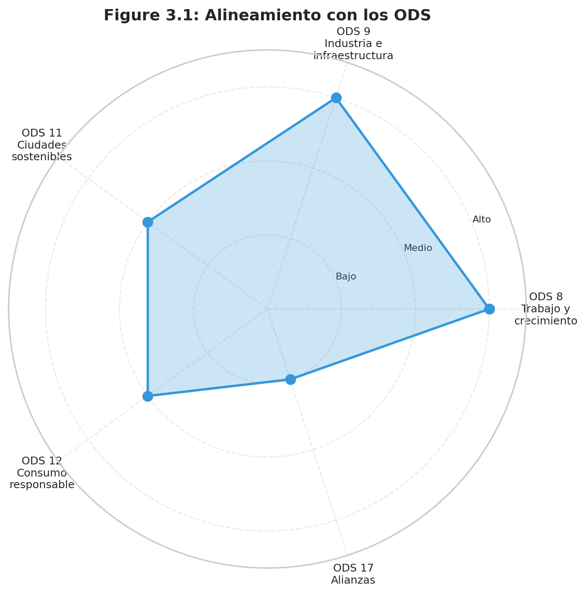
> Ilustración 3.1. Alineamiento del trabajo con los Objetivos de Desarrollo Sostenible.


---

# Capítulo 4. Desarrollo

El código fuente completo del trabajo, organizado en diez cuadernos Jupyter ejecutables y reproducibles (NB00 a NB09), está disponible públicamente en el repositorio de GitHub https://github.com/DieGodMF4/Macro-Aviation-Tourism-Modeling, junto con los conjuntos de datos brutos y procesados, los scripts de generación de figuras y la presente memoria. Las menciones a los cuadernos a lo largo de este capítulo y del Capítulo 5 utilizan la nomenclatura abreviada NB00 a NB09 conforme a la convención del repositorio; cada cuaderno tiene un nombre descriptivo dentro de la carpeta docs/ que facilita su identificación.

Este capítulo describe la metodología seguida y las fases iniciales del desarrollo del trabajo. Conforme a la estructura acordada con el tutor, este capítulo cubre las fases que van desde la comprensión del problema y los datos hasta la preparación del panel de variables, es decir, los cuadernos Jupyter NB00 a NB04. La construcción y la evaluación de los modelos predictivos —cuadernos NB05 a NB09— se desarrollan en el Capítulo 5, dado que sus resultados son indisociables de la presentación misma de cada modelo. No obstante, este capítulo introduce el marco metodológico común y describe brevemente las técnicas que se aplicarán posteriormente, de modo que el Capítulo 5 pueda concentrarse en los resultados sin necesidad de presentar las técnicas de cero.


## 4.1. Metodología

### 4.1.1. Marco metodológico: CRISP-DM

El proyecto se desarrolla bajo el estándar metodológico **CRISP-DM** (*Cross-Industry Standard Process for Data Mining*), ampliamente adoptado en la práctica de la ciencia de datos. Su naturaleza iterativa y centrada en los datos lo hace especialmente adecuado para procesos de experimentación econométrica, donde las decisiones de modelado a menudo requieren retroceder a fases previas —por ejemplo, cuando el análisis exploratorio revela la necesidad de reformular la ingeniería de variables, o cuando los resultados de un modelo sugieren revisar los criterios de selección de variables—.

> **[ILUSTRACIÓN 4.1 AQUÍ — Diagrama CRISP-DM adaptado al TFG, con los nueve cuadernos]**
> *Diagrama del proceso CRISP-DM con sus seis fases mapeadas a los nueve cuadernos Jupyter. Comprensión del negocio → revisión bibliográfica y NB00; Comprensión de los datos → NB01–NB03; Preparación de los datos → NB04; Modelado → NB05–NB07 y NB09; Evaluación → integrada en NB05–NB09; Despliegue → NB08 y NB09.*


Las seis fases del estándar se adaptan al presente trabajo como sigue. La **comprensión del negocio** queda cubierta por la revisión bibliográfica del Capítulo 2 y la definición de los objetivos. La **comprensión de los datos** se implementa en los cuadernos NB00 a NB03, que cubren la carga e inspección estructural, el análisis exploratorio univariante y multivariante y los tests estadísticos formales. La **preparación de los datos** se concentra en el cuaderno NB04, que realiza la interpolación temporal de series de frecuencia inferior, el encadenamiento estadístico de series británicas, la construcción de variables derivadas y el diagnóstico de colinealidad. El **modelado** abarca los cuadernos NB05 (baselines clásicos), NB06 (aprendizaje automático), NB07 (LSTM) y NB09 (modelo aplicado de capacidad aérea). La **evaluación** es transversal a todos los cuadernos de modelado y se consolida en el Capítulo 5. Finalmente, el **despliegue** se materializa en el cuaderno NB08, que integra los modelos en un pipeline prospectivo alimentado por proyecciones del FMI, y en el componente operativo del NB09.

### 4.1.2. Workflow del trabajo

> **[ILUSTRACIÓN 4.2 AQUÍ — Workflow general del trabajo, siguiendo el TFT01]**
> *Diagrama de flujo que muestra la secuencia completa: (1) Definición de objetivos y revisión bibliográfica → (2) Recopilación de datos brutos (Eurostat, ONS, FMI) → (3) Procesamiento y armonización del panel (NB00–NB04) → (4) Análisis exploratorio y diagnóstico de propiedades estadísticas → (5) Construcción de baselines y modelos de complejidad creciente (NB05–NB07, NB09) → (6) Validación cruzada temporal y comparativa rigurosa → (7) Aplicaciones prospectivas y causales (NB08) → (8) Síntesis y comunicación de resultados (memoria y documento ejecutivo). Cada nodo del diagrama identifica el cuaderno o cuadernos correspondientes.*

### 4.1.3. Técnicas que se utilizan en el trabajo

Antes de describir las fases concretas de preparación de datos, conviene presentar de forma resumida las técnicas que se aplicarán a lo largo del trabajo, de modo que el lector disponga de una visión global del aparato metodológico empleado y la presentación posterior de los resultados resulte autocontenida.

**SARIMA y SARIMAX.** Modelos autorregresivos integrados de media móvil con componente estacional. SARIMA modela exclusivamente la dinámica univariante de la serie objetivo; SARIMAX extiende esta estructura incorporando regresores exógenos. Son la referencia clásica de la econometría de series temporales para datos mensuales con estacionalidad marcada (Box y Jenkins, 1976).

**Holt-Winters.** Suavizado exponencial con componentes de nivel, tendencia y estacionalidad. Sus tres parámetros se estiman por máxima verosimilitud. Representa el estado del arte estadístico clásico para series estacionales sin variables exógenas.

**Naive estacional.** Modelo de referencia trivial que consiste en predecir el valor de cualquier mes futuro como el valor observado en el mismo mes del año anterior: `prediction[t] = observed[t-12]`. No requiere estimación de parámetros ni ajuste y funciona como benchmark mínimo: cualquier modelo más sofisticado debe superar al naive para justificar su uso. En series fuertemente estacionales como la del presente trabajo, el naive estacional captura por construcción toda la regularidad anual, lo que lo convierte en un competidor sorprendentemente fuerte en horizontes cortos. Su rendimiento en el conjunto de baselines (Sección 5.1) y como referencia frente al modelo aplicado de capacidad aérea (Sección 5.5) se discutirá en el Capítulo 5.

**Random Forest y XGBoost.** Modelos basados en *ensembles* de árboles de decisión. Random Forest (Breiman, 2001) promedia las predicciones de árboles entrenados sobre muestras *bootstrap*; XGBoost (Chen y Guestrin, 2016) optimiza secuencialmente los errores de modelos previos mediante *gradient boosting*. Ambos capturan relaciones no lineales e interacciones entre variables sin necesidad de especificación funcional previa.

**LSTM (Long Short-Term Memory).** Red neuronal recurrente diseñada por Hochreiter y Schmidhuber (1997) para capturar dependencias temporales de largo plazo mediante puertas de memoria que controlan el flujo de información a través del tiempo, superando los problemas de gradiente que afectan a las arquitecturas recurrentes clásicas. Su aplicación a la predicción de demanda turística ha sido validada por Salamanis et al. (2022), que documentan mejoras significativas frente a los modelos clásicos en horizontes largos. En este trabajo se exploran dos variantes arquitecturales: LSTM-1step (predicción a un paso, aplicable recursivamente para horizontes mayores) y LSTM-direct12 (predicción directa del vector completo de doce meses en un único paso).


**CausalImpact y BSTS.** Marco bayesiano desarrollado por Brodersen et al. (2015) para inferencia causal contrafactual en series temporales. A partir de un modelo *Bayesian Structural Time Series* entrenado sobre el período pre-intervención, construye una serie contrafactual que estima cuál habría sido la evolución del objetivo en ausencia del shock. La diferencia entre serie observada y contrafactual, integrada en el tiempo y dotada de un intervalo de credibilidad, constituye la estimación del impacto causal.

**Métricas de evaluación.** Se emplean tres métricas estándar: el error cuadrático medio (*Root Mean Square Error*, RMSE), el error absoluto medio (*Mean Absolute Error*, MAE) y el error porcentual absoluto medio (*Mean Absolute Percentage Error*, MAPE). El MAPE es la métrica principal por su interpretabilidad, mientras que RMSE y MAE complementan el diagnóstico cuando los errores presentan asimetrías.

**Test de Diebold-Mariano.** Test estadístico formal para comparar la precisión predictiva de dos modelos sobre un conjunto común de predicciones (Diebold y Mariano, 1995). Se aplica con la corrección de Harvey, Leybourne y Newbold (1997) para mitigar el sesgo en muestras pequeñas, situación frecuente en validación temporal de series turísticas.

**Backtest de ventana expansiva.** Esquema de validación temporal en el que el modelo se reentrena en sucesivos orígenes distribuidos a lo largo de la serie, evaluándose en cada origen sobre múltiples horizontes (1, 3, 6 y 12 meses). Proporciona estimaciones de precisión más robustas que un único hold-out y revela la sensibilidad del modelo al período de evaluación.

## 4.2. Fuentes de datos y construcción del panel (NB00)

El cuaderno NB00 implementa la carga de todos los conjuntos de datos brutos y la unificación de su estructura. Los datos proceden mayoritariamente de Eurostat, complementados con series del ONS del Reino Unido y, para el módulo prospectivo del Capítulo 5, con proyecciones del *World Economic Outlook* del FMI.

El período de estudio abarca desde enero de 2011 hasta noviembre de 2025, con un total de 179 observaciones mensuales. La elección de 2011 como inicio responde a la disponibilidad completa y armonizada de todos los conjuntos relevantes tras la entrada en vigor del Reglamento (UE) 692/2011 sobre estadísticas europeas de turismo.

**Variable objetivo.** Las pernoctaciones mensuales de turistas extranjeros en establecimientos de alojamiento turístico en Polonia, extraídas del conjunto Eurostat `tour_occ_nim` (Eurostat_a, 2025) con los filtros `c_resid = FOR` (residentes en el extranjero), `nace_r2 = I551-I553` (alojamiento turístico completo) y `unit = NR` (número). El rango observado va de 83.695 pernoctaciones —mínimo de abril de 2020, en el momento más severo del confinamiento— a 2.453.961 —máximo de agosto de 2024—, con una media en torno a 1,19 millones.

**Mercados emisores y criterio de ponderación.** Dada la limitación estructural del conjunto `tour_occ_nim` (Eurostat_a, 2025), que no desagrega por país de origen, la dimensión de los emisores se incorpora a través de variables exógenas ponderadas por la cuota de pasajeros aéreos derivada del conjunto `avia_paoc`(Eurostat_d, 2025). Los nueve mercados considerados, con sus cuotas promedio del período, son España (19,8 %), Alemania (19,5 %), Reino Unido (18,8 %), Francia (14,4 %), Italia (13,5 %), Países Bajos (6,6 %), Suecia (3,2 %), Austria (2,9 %) y Chequia (1,4 %). Estos nueve países cubren aproximadamente la totalidad del tráfico aéreo de pasajeros hacia Polonia.

**Variables exógenas y fuentes.** Los regresores se agrupan en cuatro bloques. (i) Precios: Índice Armonizado de Precios al Consumo mensual (`prc_hicp_midx`, base 2015=100)(Eurostat_e, 2025) para Polonia y los nueve emisores, y tipos de cambio bilaterales frente al euro (`ert_bil_eur_m`)(Eurostat_f, 2025) para las monedas no-euro. (ii) Renta y demografía: PIB real trimestral (`namq_10_gdp`)(Eurostat_b, 2025) y población anual (`demo_pjan`)(Eurostat_c, 2025), de los que se deriva el PIB per cápita. (iii) Sentimiento económico: Indicador de Confianza del Consumidor mensual (`ei_bsco_m`)(Eurostat_g, 2025) para Alemania, mercado emisor con mayor peso y serie más extensa. (iv) Conectividad aérea: asientos disponibles mensuales en aeropuertos polacos (`avia_tf_aca`)(Eurostat_h, 2025).

**Integración del Reino Unido mediante chain-linking.** Tras la retirada del Reino Unido del Sistema Estadístico Europeo, sus series en Eurostat se interrumpen o presentan rupturas metodológicas difícilmente comparables con las del resto de mercados. Dado que el Reino Unido representa la tercera cuota mayor del tráfico aéreo hacia Polonia, excluirlo o extrapolarlo sería gravemente problemático. La solución adoptada es el encadenamiento estadístico con series oficiales del ONS: para cada serie afectada —HICP (serie ONS `D7BT`), PIB real (`ABMI`) y población (`UKPOP`)— se identifica un período de solapamiento con la serie de Eurostat, se calcula un factor de ajuste que iguala los niveles en el punto de empalme y se construye una serie compuesta que utiliza Eurostat antes del empalme y ONS (reescalado) después. Este procedimiento, estándar en econometría aplicada, preserva las tasas de crecimiento efectivas del ONS y mantiene la armonización del nivel con el resto del panel. La Ilustración 4.3 muestra el resultado del encadenamiento estadístico aplicado al HICP y al PIB del Reino Unido: los segmentos de Eurostat y de ONS se unen con continuidad en el punto de empalme, evidenciando que el factor de reescalado ha sido correctamente estimado.

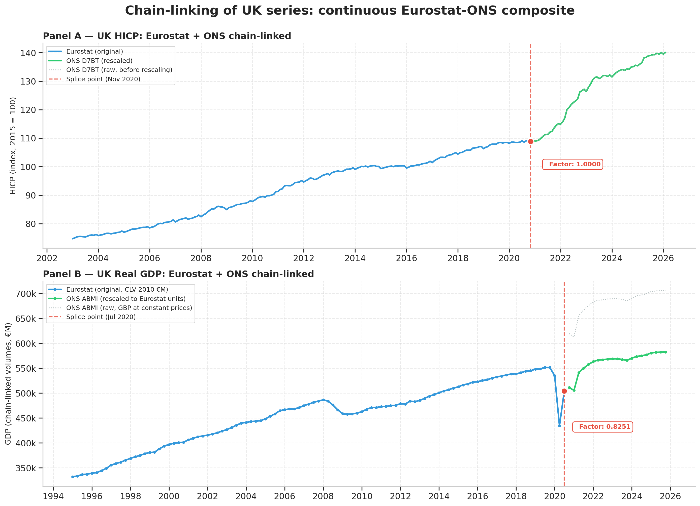

## 4.3. Análisis exploratorio univariante (NB01)

El cuaderno NB01 caracteriza la variable objetivo mediante visualización temporal, descomposición estacional y análisis de la distribución. Las características estructurales más relevantes son una **estacionalidad muy marcada**, con un ratio entre el pico de agosto (alrededor de 1,87 millones en el período pre-pandemia) y el valle de enero (en torno a 783.000) cercano a 2,4; un **impacto severo del COVID-19**, con un colapso interanual del 96,3 % en abril de 2020 y un período de recuperación de aproximadamente 28 meses; y una **proporción de turistas extranjeros sobre el total** del orden del 18,8 % en promedio, lo que sitúa a Polonia como un destino predominantemente doméstico aunque con un segmento internacional creciendo a ritmo superior y constituyendo el foco del presente trabajo. Estas características quedan representadas en la Ilustración 4.4: el Panel A muestra la serie mensual con su tendencia suavizada y el shock COVID sombreado, el Panel B representa las tasas de crecimiento interanual con el colapso de 2020–2021 claramente visible, y el Panel C presenta el mapa de calor año × mes que destaca la concentración estival y el "parche oscuro" pandémico.

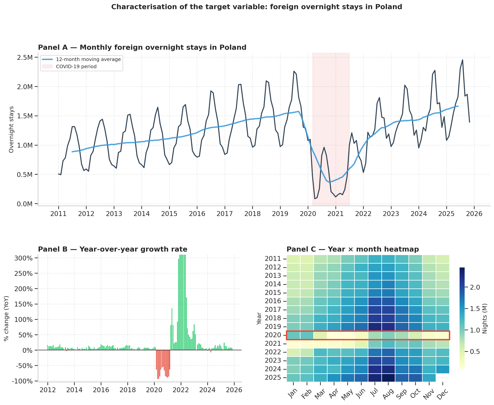

## 4.4. Análisis exploratorio multivariante y diagnóstico estadístico (NB02–NB03)

El cuaderno NB02 examina las relaciones entre la variable objetivo y los regresores candidatos mediante matrices de correlación y funciones de correlación cruzada (CCF) a retardos de 0 a 12 meses, contrastando los resultados obtenidos en niveles absolutos frente a los obtenidos en variaciones interanuales (YoY). El contraste entre ambas representaciones resulta extraordinariamente revelador y orienta el resto de decisiones metodológicas del trabajo. La Ilustración 4.5 presenta ambos heatmaps lado a lado para facilitar la comparación entre las correlaciones contaminadas por tendencia (Panel A) y las correlaciones limpias en variaciones interanuales (Panel B).

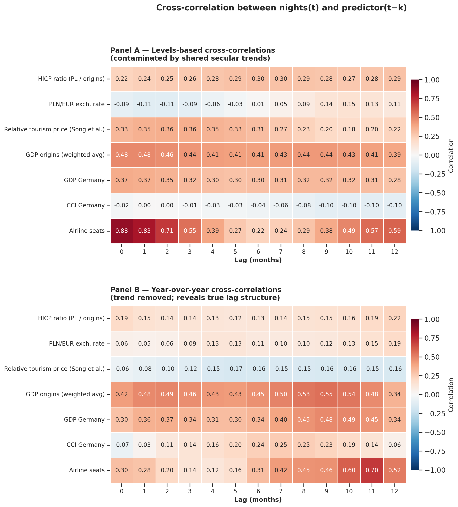


**Correlaciones en niveles.** La capacidad aérea contemporánea (`seats`) presenta la correlación más alta con el objetivo (r = 0,88 a lag 0), seguida del PIB de los emisores ponderado (r = 0,48 a lag 0) y del PIB alemán (r = 0,37 a lag 0). El resto de regresores macroeconómicos —ratio HICP, tipo de cambio, precio turístico relativo, confianza del consumidor— presentan correlaciones bajas o muy bajas en valor absoluto (todas por debajo de 0,40). Estos valores de niveles **están contaminados por la tendencia secular compartida**: todas las series macroeconómicas tienen una tendencia creciente sostenida desde 2011 que produce correlaciones espurias con la demanda turística, también creciente. Por ello, la inferencia sustantiva debe basarse en el análisis en variaciones interanuales.

**Correlaciones en variaciones interanuales.** Tras eliminar el componente tendencial, el ranking cambia sustancialmente y, sobre todo, emerge una estructura de retardos óptimos no triviales:

- La **capacidad aérea** se mantiene como predictor dominante, pero con un patrón temporal radicalmente distinto: la correlación contemporánea cae a r = 0,30, mientras que el pico se desplaza al **retardo de once meses (r = 0,70)**. Esta es la evidencia empírica más nítida en favor de la decisión metodológica de utilizar `seats_lag6` o retardos largos en lugar de la capacidad contemporánea: las decisiones de programación de capacidad anticipan la demanda con muchos meses de antelación, conforme al horizonte estándar de asignación de slots IATA.
- El **PIB de los emisores ponderado** mantiene una correlación robusta y estable en torno a r = 0,42–0,55 a lo largo de todos los retardos del 0 al 11, con pico a lag 9 (r = 0,55). Lo mismo se observa, con magnitudes algo inferiores, para el PIB alemán (pico a lag 10 con r = 0,49).
- El **indicador de confianza del consumidor alemán** confirma su papel teórico de indicador adelantado: la correlación contemporánea es prácticamente nula (r = –0,07) pero crece progresivamente hasta alcanzar su pico en torno a los retardos 7–8 (r = 0,24–0,25), consistente con la intuición de que los hogares deciden y planifican sus viajes varios meses antes de materializarlos.
- Las variables de **precios y tipos de cambio** (HICP ratio, PLN/EUR, precio turístico relativo) presentan correlaciones lineales débiles en variaciones interanuales (todas con |r| ≤ 0,22). Este hallazgo no implica que no sean relevantes para la demanda, sino que su relación con el objetivo no es bien capturada por una correlación lineal monótona. Esta es una de las motivaciones empíricas que justifican el salto desde modelos econométricos clásicos (lineales por construcción) hacia modelos de aprendizaje automático y aprendizaje profundo, capaces de capturar relaciones no lineales y de interacción entre variables.

El cuaderno NB03 formaliza este análisis exploratorio con tests estadísticos de propiedades de las series. Los tests ADF y KPSS confirman que la serie objetivo es no estacionaria en niveles y se vuelve estacionaria al tomar diferencias estacionales. Los tests de causalidad de Granger detectan relación de precedencia temporal entre la mayoría de los regresores macroeconómicos y la variable objetivo, conforme a la dirección teórica esperada. El hallazgo más relevante de este cuaderno, sin embargo, es la **detección de causalidad de Granger en ambos sentidos entre capacidad aérea y demanda turística**, confirmando de manera argumentada la sospecha de endogeneidad bidireccional ya señalada en el Capítulo 2 y motivando el esquema de cuatro especificaciones del NB06.


## 4.5. Ingeniería de variables y diagnóstico de colinealidad (NB04)

El cuaderno NB04 culmina la fase de preparación de datos con la construcción de variables derivadas, el tratamiento del COVID-19 mediante variables ficticias (*dummies*) y un diagnóstico sistemático de colinealidad.

**Variables derivadas.** Se construye el precio turístico relativo (`relprice_wavg`) según la formulación de Song et al. (2010) descrita en el Capítulo 2, el PIB per cápita ponderado de los orígenes (`gdp_pc_origins_wavg`) y la población ponderada (`pop_origins_wavg`). Siguiendo recomendación explícita del tutor —validada posteriormente mediante VIF—, se adopta el par **PIB per cápita más población** como información completa, en lugar del trío PIB agregado más PIB per cápita más población, que sería matemáticamente redundante.

**Tratamiento del COVID-19.** Se construyen dos *dummies* complementarias: `covid_strong` (igual a 1 entre marzo de 2020 y diciembre de 2021), que captura la fase aguda del colapso, y `covid_post` (igual a 1 desde enero de 2022), que captura el cambio de nivel permanente post-pandemia. Esta estructura de dos fases permite al modelo estimar simultáneamente el efecto del colapso agudo y el desplazamiento de nivel posterior, evitando la necesidad de correcciones manuales.

**Variables con retardo.** En el análisis de series temporales, una variable con retardo `lag_k` representa el valor de esa variable observado `k` meses antes del momento de referencia: así, `nights_lag12` denota las pernoctaciones ocurridas doce meses antes del mes actual, y `cci_DE_lag2` denota el Indicador de Confianza del Consumidor alemán observado dos meses antes. La incorporación de variables con retardo en un modelo predictivo cumple tres funciones complementarias. En primer lugar, captura la **inercia temporal** de la serie: la demanda turística de un mes determinado está fuertemente correlacionada con la del mismo mes del año anterior por motivos estacionales evidentes, y esta correlación es información explotable que se materializa en el retardo de doce meses. En segundo lugar, permite incorporar variables explicativas que actúan con **desfase temporal**, como los indicadores adelantados de confianza del consumidor —que típicamente anticipan las decisiones de gasto con uno o dos meses de antelación—. En tercer lugar, y particularmente relevante para el presente trabajo, los retardos permiten reflejar **restricciones operativas reales**: las aerolíneas planifican capacidad con varios meses de antelación según las directrices IATA sobre asignación de slots aeroportuarios, lo que justifica el uso de la capacidad aérea observada seis meses antes (seats_lag6) como predictor de la demanda contemporánea sin incurrir en el problema de endogeneidad bidireccional documentado en el Capítulo 2.
Con estas tres justificaciones, las variables con retardo construidas en este cuaderno son `nights_lag1` y `nights_lag12` (retardos autorregresivos de uno y doce meses de la propia variable objetivo), `gdp_origins_lag3` (alineado con el pico de correlación cruzada del PIB de los mercados emisores observado en el NB02), `cci_DE_lag2` (alineado con la dinámica adelantada de la confianza del consumidor alemán) y `seats_lag6` (predeterminado por el horizonte estándar de asignación de slots IATA). La elección de cada retardo específico está documentada empíricamente: se identifica el retardo de cada variable como aquel que maximiza la correlación cruzada con la variable objetivo dentro del rango temporalmente razonable, evitando así la introducción arbitraria de variables retardadas sin justificación.


**Diagnóstico de colinealidad.** Se calcula el Factor de Inflación de la Varianza (VIF) sobre primeras diferencias, que es la métrica relevante cuando las series comparten tendencia secular y la versión en niveles produciría valores artificialmente inflados. El diagnóstico identifica dos grupos de variables con problemas de colinealidad:

- **Colinealidad severa (VIF > 20):** `gdp_pc_origins_wavg` (VIF = 23,97) y `gdp_pc_DE` (VIF = 22,86) presentan colinealidad mutua importante, consecuencia de que Alemania pesa cerca del 20 % en el agregado ponderado y por tanto ambas variables comparten una porción sustancial de su variación. La correlación bivariada directa entre ambas es del 0,95.

- **Colinealidad moderada (5 < VIF < 10):** `relprice_wavg` (VIF = 9,14) y `exr_pln` (VIF = 8,97) presentan colinealidad moderada con el resto del bloque de precios y tipos de cambio, derivada de que ambas comparten dinámica con el ratio HICP a través del tipo de cambio bilateral.

Estas detecciones, junto con la endogeneidad bidireccional de la capacidad aérea documentada en el NB03, se sintetizan en una **tabla de decisión reproducible** (Ilustración 4.6) que asigna a cada variable candidata una de tres acciones. Las acciones DROP por endogeneidad afectan a `seats` contemporáneo y a `nights_lag1`: ambas son altamente predictivas (r = 0,88 con el objetivo) pero su uso como predictores produciría modelos académicamente informativos y operativamente irrealizables, conforme a la distinción articulada en la Sección 4.6. Las acciones CHECK afectan a las cuatro variables con VIF > 5: no se eliminan a priori, sino que se evalúan empíricamente por especificación en el NB06 mediante el esquema de cuatro modelos de complejidad decreciente (M1 a M4), que cuantifica cuánta precisión predictiva se pierde al restringir progresivamente la información colineal. Las acciones KEEP afectan al resto de variables del *feature set*, incluidos los retardos seriales no endógenos (`nights_lag12`, `cci_DE_lag2`, `seats_lag6`) y las dos dummies COVID.

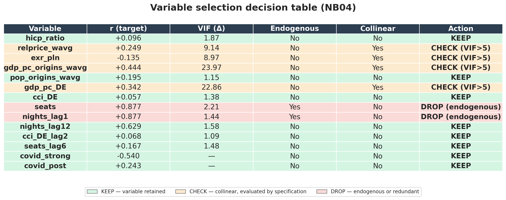

A modo ilustrativo del estilo de código empleado a lo largo del trabajo, se reproduce a continuación el fragmento de NB04 que implementa el encadenamiento estadístico del HICP del Reino Unido, una de las operaciones técnicamente más delicadas del *pipeline* de datos. El código completo se encuentra disponible en el repositorio del proyecto.

```python
def chain_link(eurostat_series, ons_series, overlap_start, overlap_end):
    """Encadena dos series temporales en el período de solapamiento,
    preservando las tasas de crecimiento de la serie ONS y reescalando
    al nivel de Eurostat en el punto de empalme.
    """
    overlap_es = eurostat_series.loc[overlap_start:overlap_end]
    overlap_on = ons_series.loc[overlap_start:overlap_end]
    # Factor de ajuste por mínimos cuadrados sobre el período de solapamiento
    scale_factor = (overlap_es * overlap_on).sum() / (overlap_on ** 2).sum()
    # Construcción de la serie compuesta
    composite = pd.concat([
        eurostat_series.loc[:overlap_start - pd.DateOffset(days=1)],
        ons_series.loc[overlap_start:] * scale_factor,
    ])
    return composite.sort_index()
```

## 4.6. Distinción académica frente a operativa en la selección de variables

Una decisión metodológica transversal al resto del trabajo, articulada en diálogo con el tutor, es la distinción explícita entre el objetivo académico de inferir los determinantes de la demanda y el objetivo operativo de producir predicciones útiles bajo restricciones de disponibilidad temporal de la información. La diferencia no es teórica: en un contexto académico es correcto mantener los retardos autorregresivos de corto plazo (`nights_lag1`) porque la autocorrelación de primer orden está bien documentada y permite modelar correctamente la inercia de la serie; en un contexto operativo, una aerolínea que planifica capacidad con seis meses de antelación no dispone del valor de `nights_lag1` cuando toma la decisión, y por tanto un modelo entrenado y evaluado usando `nights_lag1` produce predicciones académicamente informativas pero operativamente irrealizables.

Esta distinción justifica que en el Capítulo 5 se evalúen sistemáticamente varias especificaciones del mismo modelo, desde la más completa hasta una restringida a información operativamente disponible, midiendo de forma explícita el coste de la honestidad operativa. La diferencia cuantificada entre ambas especificaciones es uno de los hallazgos relevantes del trabajo y se reportará en el capítulo siguiente.

## 4.7. Resumen del estado al cierre del Capítulo 4

Al cerrar el Capítulo 4, el trabajo dispone de un panel mensual consolidado de 179 observaciones × más de 30 variables, con las series del Reino Unido encadenadas a Eurostat, las dummies de COVID definidas, las variables con retardo construidas, las redundancias diagnosticadas y eliminadas, y la distinción académica-operativa formulada de manera explícita. Sobre este panel se construyen, en el Capítulo 5, los modelos predictivos y se obtienen los resultados que materializan los objetivos del trabajo.

---

# Capítulo 5. Resultados

Este capítulo presenta y discute los resultados de los cinco cuadernos de modelado del trabajo: NB05 (baselines clásicos), NB06 (aprendizaje automático), NB07 (LSTM), NB08 (escenarios prospectivos y análisis causal del COVID) y NB09 (modelo aplicado de capacidad aérea). El orden de presentación es deliberadamente el de complejidad creciente, de modo que cada modelo se evalúa contra los anteriores y los hallazgos se acumulan progresivamente.

## 5.1. Baselines clásicos (NB05)

El cuaderno NB05 implementa y evalúa cuatro baselines: Naive Seasonal, Holt-Winters, SARIMA y SARIMAX, comparados sobre los últimos doce meses del panel como hold-out.

Los resultados se resumen en la Tabla 5.1.

**Tabla 5.1. MAPE de los baselines clásicos en el hold-out de los últimos 12 meses.**

| Modelo | RMSE | MAE | MAPE |
|:---|---:|---:|---:|
| Holt-Winters | 92.651 | 64.078 | 3,9 % |
| SARIMA(1,1,1)(1,1,1)₁₂ | 128.826 | 106.085 | 6,0 % |
| SARIMAX(1,1,1)(1,1,1)₁₂ | 138.428 | 118.505 | 6,6 % |
| Naive Seasonal | 167.404 | 149.398 | 9,1 % |

La Ilustración 5.1 visualiza estas predicciones sobre el hold-out, donde se observa que los cuatro baselines capturan correctamente la forma estacional pero difieren en su capacidad de seguir la dinámica del último año.

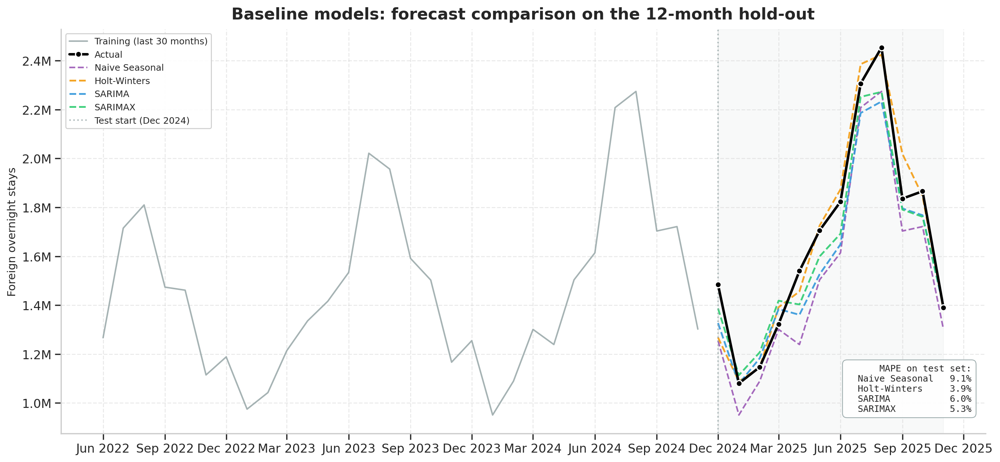

Dos hallazgos merecen comentario detallado.

**El "éxito" aparente de Holt-Winters es una solución numéricamente degenerada.** Su MAPE del 3,9 % supera ampliamente al de los demás modelos, pero la inspección de los parámetros optimizados revela una configuración degenerada: $\alpha = 1$ (el modelo prácticamente ignora la media móvil del nivel y usa el último valor observado), $\beta = 0$ (sin componente de tendencia) y $\gamma = 0$ (sin componente estacional). Esta configuración equivale a un modelo altamente reactivo al último dato disponible, que produce predicciones precisas en períodos estables pero colapsa completamente ante cambios estructurales. No constituye un resultado robusto y se reporta con esa advertencia explícita.

**El SARIMAX pierde marginalmente contra el SARIMA univariante.** Este hallazgo es contraintuitivo pero empíricamente robusto: incorporar las variables exógenas al SARIMA no mejora su precisión, sino que la empeora ligeramente (MAPE 6,6 % frente a 6,0 %). La interpretación, consistente con Gunter y Smeral (2016) y validada por el tutor, es que en modelos lineales los retardos autorregresivos ya absorben la variación sistemática que las exógenas podrían explicar. Añadirlas en una estructura lineal saturada introduce ruido de estimación sin ganancia informacional. Este hallazgo motiva conceptualmente el salto a modelos no lineales en los cuadernos siguientes.


## 5.2. Modelos de aprendizaje automático con cuatro especificaciones (NB06)

El cuaderno NB06 implementa Random Forest y XGBoost en cuatro especificaciones comparativas, diseñadas para aislar empíricamente la contribución marginal de cada bloque informacional y resolver el problema de endogeneidad de la capacidad aérea descrito en los capítulos previos.

**Las cuatro especificaciones, en orden de complejidad decreciente.**

- **M1-Full:** todas las features disponibles, incluida la capacidad aérea contemporánea y los retardos autorregresivos cortos. Es la especificación "ingenua" que un analista produciría sin diagnosticar la endogeneidad.
- **M2-Curated:** M1 menos redundancias identificadas y menos la capacidad contemporánea (eliminada por la endogeneidad bidireccional confirmada en NB03). Conserva `nights_lag1` y `nights_lag12`.
- **M3-NoLag1:** M2 menos `nights_lag1`. Mantiene `nights_lag12` (memoria estacional) y `seats_lag6` (predeterminado por el horizonte IATA). Esta es la **especificación operativa honesta**: solo utiliza información disponible al momento de la decisión.
- **M4-MacroOnly:** M3 menos los retardos seriales. Sólo features macroeconómicas y de control. Test de estrés extremo.

Los resultados del backtest con ventana expansiva sobre el período excluyendo COVID, a horizonte de 12 meses, se presentan en la Tabla 5.2. Las columnas h=1, h=3, h=6, h=12 indican el número de meses de antelación con que se realiza la predicción.

**Tabla 5.2. MAPE en backtest expansivo ex-COVID por especificación y horizonte de predicción**

| Modelo y especificación | 1 mes | 3 meses | 6 meses | 12 meses |
|:---|---:|---:|---:|---:|
| RF M1-Full | 6,2 % | 7,0 % | 7,2 % | 8,2 % |
| RF M2-Curated | 6,2 % | 7,1 % | 7,2 % | 8,7 % |
| RF M3-NoLag1 | 7,6 % | 10,3 % | 12,8 % | 21,2 % |
| RF M4-MacroOnly | 19,4 % | 24,0 % | 23,4 % | 25,4 % |
| XGB M1-Full | 5,4 % | 6,6 % | 6,9 % | 7,6 % |
| XGB M2-Curated | 5,9 % | 7,5 % | 8,3 % | 9,4 % |
| XGB M3-NoLag1 | 7,1 % | 10,3 % | 12,6 % | 14,3 % |
| XGB M4-MacroOnly | 11,2 % | 17,5 % | 19,6 % | 16,9 % |

La Ilustración 5.2 representa visualmente los MAPE de la Tabla 5.2 frente al horizonte de predicción, separando Random Forest (panel izquierdo) y XGBoost (panel derecho).

**Lectura de los hallazgos.** La progresión M1 → M2 → M3 → M4 cuantifica el coste empírico de cada restricción metodológica.

El paso de M1 a M2 elimina la capacidad aérea contemporánea (endógena) y las redundancias. La caída de precisión es pequeña, lo que demuestra que la capacidad contemporánea aportaba menos valor predictivo del que sugería su importancia bruta: era endógena y dominante en atribución pero su poder predictivo neto era moderado.

El paso de M2 a M3 elimina el retardo autorregresivo de corto plazo. Esta es la caída más grande, especialmente en Random Forest (12,5 puntos porcentuales) y también significativa en XGBoost (4,9 puntos). Es, literalmente, **el coste operativo de la honestidad**: lo que se pierde al no poder utilizar `nights_lag1` porque no estará disponible al momento de la decisión.

El paso de M3 a M4 elimina los retardos seriales remanentes (`nights_lag12` y `seats_lag6`). La caída adicional indica que estos retardos aportan información genuina por encima de las features puramente macroeconómicas, lo que valida su inclusión en el feature set operativo.

**Redistribución de la importancia de variables.** Cuando los atajos autorregresivos se eliminan progresivamente, la importancia se redistribuye sanamente hacia las variables macroeconómicas. En M1, tres variables (la capacidad contemporánea, `nights_lag1` y `nights_lag12`) concentran el 97 % de la importancia, dejando a las macroeconómicas prácticamente sin contribución. En M3, en cambio, emergen con importancia visible `cci_DE_lag2`, `hicp_ratio` y `exr_pln`, validando empíricamente los determinantes teóricos identificados por la literatura una vez que se eliminan los atajos que los enmascaraban.

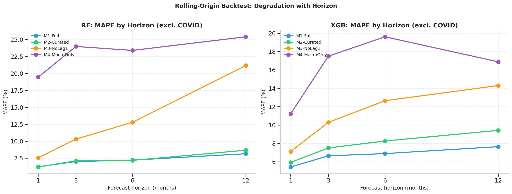

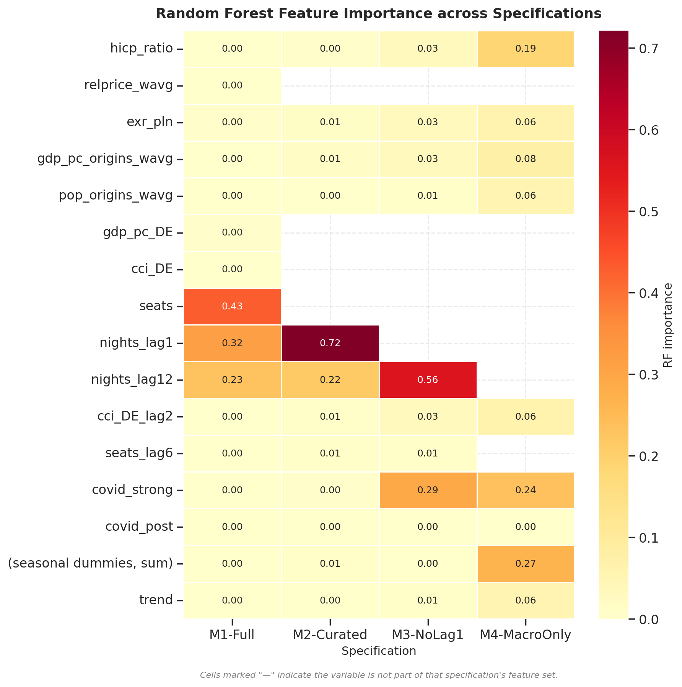


## 5.3. Aprendizaje profundo con transformación interanual (NB07)

El cuaderno NB07 implementa dos arquitecturas LSTM (1step recursivo y direct12) bajo dos formulaciones del objetivo (niveles y ratio interanual), por un total de cuatro variantes. La motivación de la formulación interanual se desarrolla a continuación; los resultados se reportan después.

### 5.3.1. Diagnóstico de tres regímenes y motivación de la formulación interanual

Antes de entrenar los modelos, el cuaderno NB07 realiza un diagnóstico empírico de la serie objetivo descomponiéndola en tres regímenes: pre-COVID (2011-2019), recuperación (2022-2023) y post-COVID estable (2024-2025). El análisis revela que las **correlaciones entre los patrones estacionales de los tres regímenes** son extraordinariamente altas (entre 0,94 y 0,98), indicando que la forma estacional del año en Polonia es esencialmente la misma a través del shock pandémico. En cambio, los **niveles absolutos cambian sustancialmente**, con el promedio post-COVID aproximadamente un 40 % superior al pre-COVID. Las tasas de crecimiento interanual, por su parte, son comparables entre regímenes (medias entre el 7,7 % y el 9,7 %, desviaciones similares).

Estas observaciones tienen una implicación metodológica directa. Un LSTM que aprenda directamente los niveles absolutos tiene que aprender simultáneamente la forma estacional (que es estable) y el nivel (que no lo es). El componente de nivel domina la función de pérdida y resta capacidad al aprendizaje de la forma, produciendo un modelo que falla cuando el régimen de evaluación difiere del régimen dominante de entrenamiento. Reformular el objetivo como ratio interanual `nights[t]/nights[t-12]` neutraliza el cambio de nivel —que se queda implícito en el denominador, observado y específico de cada mes— y deja a la red aprender únicamente el componente estable.

### 5.3.2. Protocolo de entrenamiento y exclusión COVID

Las redes recurrentes son sensibles a las discontinuidades estructurales: con aproximadamente 25 observaciones afectadas por el COVID en un conjunto de unas 150 secuencias, no disponen de muestra suficiente para aprender la lógica condicional implícita en una dummy. Por ello el LSTM excluye explícitamente del entrenamiento el período entre enero de 2020 y diciembre de 2022, construyendo secuencias en dos bloques contiguos (pre-COVID y post-COVID). La ventana de exclusión hasta diciembre de 2022 —en lugar de un corte más temprano— se justifica por la observación de que las tasas interanuales se normalizan a partir de 2023.

Para garantizar comparabilidad justa con los modelos tabulares, se reentrena un XGBoost bajo el mismo protocolo de exclusión (XGB-noCOVID) y se incluye también el XGB original entrenado sobre el panel completo con dummies (XGB-Original).

### 5.3.3. Resultados del hold-out simple

Los resultados sobre el hold-out de los últimos doce meses se presentan en la Tabla 5.3, ordenados por MAPE de menor a mayor.

**Tabla 5.3. Resultados del hold-out simple (12 meses), todas las métricas en niveles absolutos.**

| Modelo | RMSE | MAE | MAPE |
|:---|---:|---:|---:|
| LSTM-direct12 V2 (YoY) | 89.563 | 68.563 | 4,36 % |
| LSTM-1step V2 (YoY) | 96.269 | 74.103 | 4,71 % |
| XGB-noCOVID | 136.752 | 103.011 | 5,83 % |
| XGB-Original | 137.970 | 103.963 | 5,96 % |
| LSTM-1step V1 (niveles) | 197.268 | 140.249 | 8,18 % |
| LSTM-direct12 V1 (niveles) | 646.173 | 487.562 | 25,33 % |

**El hallazgo central es la magnitud de la mejora introducida por la formulación interanual.** En la variante recursiva, el MAPE cae del 8,18 % al 4,71 % (mejora del 42 %). En la variante de predicción directa multi-paso, la mejora es aún más espectacular: del 25,33 % al 4,36 % (mejora del 83 %). Misma arquitectura, mismos datos, mismas features; lo único que cambia es la representación del objetivo.

La asimetría entre arquitecturas es interpretable. La variante direct12 produce los doce valores en un único paso forward y por tanto está completamente expuesta al cambio de nivel entre regímenes de entrenamiento y evaluación. La variante 1step itera mes a mes y está parcialmente protegida porque cada predicción solo necesita capturar la dinámica de corto plazo. En la formulación interanual, ambas reciben el mismo "regalo metodológico": el cambio estructural queda absorbido por el denominador observado.

### 5.3.4. Backtest con ventana expansiva

El backtest expansivo sobre dieciséis orígenes distribuidos en los bloques pre y post-COVID confirma la robustez del hallazgo. En el bloque post-COVID a horizonte de doce meses, que es el horizonte y régimen relevantes para el despliegue, LSTM-direct12 V2 alcanza un MAPE del 3,33 %, frente a 6,93 % de XGB-noCOVID, prácticamente la mitad. La precisión del LSTM en este horizonte largo es además **estable**: oscila entre el 3,33 % y el 7,28 % a través de los cuatro horizontes evaluados (1, 3, 6 y 12 meses), sin degradación catastrófica, como se puede apreciar en la Ilustración 5.4.

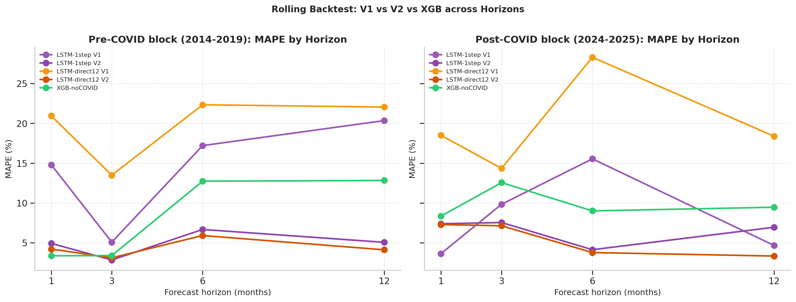

### 5.3.5. Tests de Diebold-Mariano

Los tests pareados de Diebold-Mariano a horizonte de 12 meses en el bloque post-COVID arrojan empate estadístico para casi todos los pares, debido al reducido número de forecasts solapados (n = 6). Esta es una limitación reconocida del test bajo muestras pequeñas. La decisión entre modelos no se fundamenta por tanto en significación formal sino en la **dirección consistente de las diferencias** y en su **magnitud económica**: reducir el MAPE de 6,93 % a 3,33 % es una mejora del 50 % relativo, una diferencia que cualquier analista consideraría sustancial con independencia de su p-valor.

### 5.3.6. Ranking consolidado tras NB07

Combinando los baselines del NB05, los modelos ML del NB06 y los del NB07, el ranking consolidado por MAPE en el hold-out de los últimos doce meses excluyendo soluciones degeneradas sitúa al **LSTM-direct12 V2 como el mejor modelo del trabajo (4,36 %)**, seguido del LSTM-1step V2 (4,71 %), XGB-noCOVID (5,83 %), SARIMA univariante (6,0 %) y los modelos de árboles del NB06 (6-7 %).


### 5.3.7. Importancia de variables del modelo ganador

A diferencia de los modelos basados en árboles del NB06, la arquitectura LSTM no expone una medida nativa de importancia de variables: sus pesos internos se distribuyen no linealmente a lo largo de las dos capas recurrentes y las capas densas posteriores, y no admiten interpretación directa. Para obtener una medida comparable con la reportada en la Ilustración 5.3 del Random Forest del NB06, aplicamos al modelo ganador LSTM-direct12 V2 la **permutación de importancia** (Fisher, Rudin y Dominici, 2019), técnica *model-agnostic* que cuantifica la contribución de cada variable midiendo cuánto se degrada el MAPE sobre el hold-out cuando los valores temporales de esa variable se permutan aleatoriamente dentro de la ventana de entrada del modelo.

El procedimiento, repetido diez veces por variable para estimar la dispersión del shuffling, opera sobre la ventana de doce meses que el LSTM-direct12 V2 utiliza como input. Una variable cuya permutación temporal degrada el MAPE en una cantidad apreciable aporta información útil al modelo; una variable cuya permutación deja el MAPE prácticamente inalterado no la aporta.

Las features del LSTM-direct12 V2 comprenden: cinco variables macroeconómicas (`hicp_ratio`, `exr_pln`, `gdp_pc_origins_wavg`, `pop_origins_wavg`, `cci_DE_lag2`), una variable de capacidad aérea retardada (`seats_lag6`), doce dummies estacionales mensuales (`month_01` a `month_12`) y una variable de tendencia lineal (`trend`). En la Ilustración se reportan las importancias individuales de cada una. La tabla de acrónimos del Glosario describe cada variable en detalle.

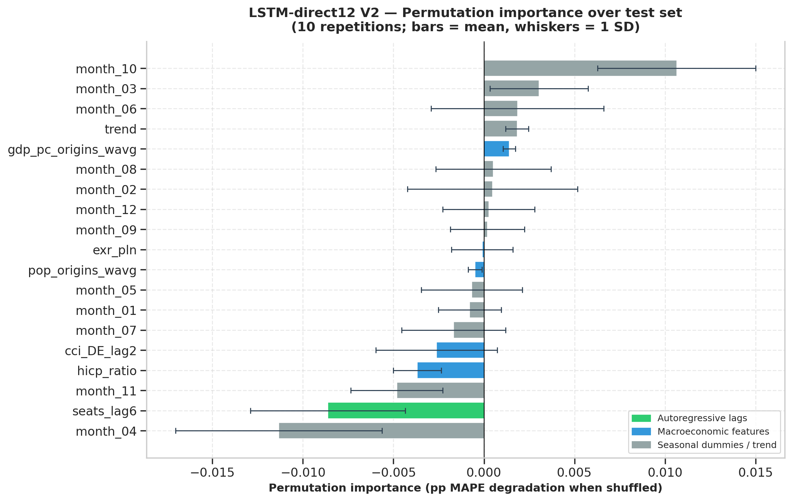

**Lectura del resultado**. El MAPE de referencia del modelo es del 4,36 % sobre el hold-out. Las degradaciones individuales obtenidas al permutar cada variable se sitúan en el rango ±0,01 puntos porcentuales. Conviene interpretar dos dimensiones distintas de este resultado.
En cuanto a la significación estadística, algunas variables presentan medias varias veces superiores a su desviación típica entre repeticiones (`hicp_ratio`: ratio 4,0; `month_10`: 2,8; `seats_lag6`: 2,3), lo que indica que su efecto sobre el MAPE al ser permutadas no es atribuible exclusivamente al ruido aleatorio del shuffling. Existen, por tanto, variables con un papel distinguible de cero en la predicción.
En cuanto a la magnitud económica, sin embargo, todas las importancias son extraordinariamente pequeñas en términos absolutos: la variable más influyente (`month_10`) degrada el MAPE en apenas 0,011 puntos porcentuales, que sobre un MAPE de referencia del 4,36 % representa un 0,25 % relativo. Es decir, ninguna variable contribuye más de una fracción muy pequeña al rendimiento agregado del modelo. La presencia de importancias negativas en variables como `month_04` o `hicp_ratio` se explica probablemente por la interacción no lineal entre features: al destruir aleatoriamente una variable, el modelo puede ocasionalmente producir predicciones marginalmente mejores cuando esa variable estaba aportando un componente de ruido o de redundancia con otras.
La lectura combinada es por tanto cualitativa, no nula: el modelo aprende algo de cada variable, pero su contribución individual es marginal. Esto es coherente con una propiedad estructural del LSTM-direct12 V2: la transformación interanual descrita en la Sección 5.3.1 hace que la variable más informativa para predecir `nights[t]` sea `nights[t−12]`, que no aparece como feature del modelo porque actúa como denominador de la transformación. Es decir, la mayor parte de la varianza predecible está absorbida en el reescalado de YoY a niveles, y el modelo solo necesita aprender un pequeño ajuste estacional y macroeconómico sobre ese ancla.

Esta lectura es plenamente consistente con tres hallazgos previos del trabajo: (i) la insensibilidad del LSTM a los escenarios macroeconómicos alternativos del IMF documentada en el NB08, que motivó la introducción del benchmark de elasticidad de Peng et al. (2015) como instrumento complementario; (ii) la redistribución sana de importancias hacia las macroeconómicas en la especificación M3 del XGBoost del NB06 cuando se restringe `nights_lag1`; y (iii) la advertencia general de Gunter y Smeral (2016) sobre la dilución de las elasticidades macroeconómicas en modelos con estructura autorregresiva dominante.

La consecuencia operativa de esta confirmación es relevante: el LSTM-direct12 V2 es un excelente **predictor central**, pero su uso como instrumento para responder a preguntas del tipo "¿cuánto influye el PIB de los emisores en la demanda turística?" no está justificado, porque el modelo trata esa variable como información residual una vez controlado el ancla estacional. La complementariedad con métodos calibrados explícitamente para la sensibilidad estructural —el benchmark de elasticidad del NB08, o el modelo OLS del NB09— no es opcional sino **necesaria** para cubrir el ámbito de análisis condicionado a inputs macroeconómicos.

## 5.4. Escenarios prospectivos y análisis causal del COVID (NB08)

El cuaderno NB08 utiliza el LSTM seleccionado en NB07 para producir predicciones bajo escenarios macroeconómicos alternativos derivados del *World Economic Outlook* del FMI, y aplica el marco *CausalImpact* para estimar el impacto causal contrafactual del COVID-19. El horizonte de predicción cubre desde febrero de 2025 hasta noviembre de 2026, totalizando 22 meses.

### 5.4.1. Construcción de los tres escenarios

Los tres escenarios se construyen ajustando la trayectoria anual de crecimiento del PIB de los mercados emisores publicada por el FMI en abril de 2025 (IMF, 2025). El escenario Tendencial utiliza el baseline sin modificar. Los escenarios Optimista y Pesimista aplican shifts compuestos de +2 puntos porcentuales y –2 puntos porcentuales respectivamente, a partir de 2026. La amplitud de ±2pp se sitúa dentro del rango de volatilidad macroeconómica histórica observable —la crisis financiera de 2008–2009 representó aproximadamente ±4 puntos sobre el crecimiento anual— y resulta visible en las predicciones del benchmark de elasticidad, aunque, como se discute más adelante, no del LSTM.

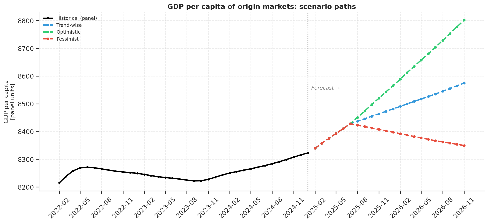

### 5.4.2. Predicción central del LSTM y el problema de la insensibilidad a escenarios

La predicción central del LSTM-direct12 V2 sitúa el total de pernoctaciones extranjeras en 2026 (enero–noviembre) en aproximadamente 19,6 millones, con una distribución estacional concentrada en los meses de verano. **Las tres predicciones del LSTM son prácticamente indistinguibles entre escenarios**, con variaciones inferiores al 0,1 %.

Este resultado no es un fallo del modelo sino una propiedad esperable del diseño del NB07: el LSTM fue calibrado para precisión predictiva, no para sensibilidad estructural. Su predicción está dominada por la dinámica estacional capturada en `nights_lag12` y `seats_lag6`, ambas invariantes entre escenarios. Su elasticidad-renta efectiva es cercana a cero por construcción. Esta robustez frente al ruido macroeconómico, que en el contexto del NB07 era una virtud, en el contexto del NB08 se convierte en una limitación que debe documentarse y resolverse con un instrumento complementario.

### 5.4.3. Benchmark de elasticidad como instrumento de sensibilidad

Para introducir sensibilidad genuina a los escenarios, el cuaderno aplica un benchmark independiente basado en la elasticidad-renta turística media de Peng et al. (2015), igual a 2,0. A diferencia del LSTM, este benchmark responde proporcionalmente a los cambios de PIB por construcción matemática. Aplicado a las trayectorias del FMI con shifts de ±2pp, produce un envelope de aproximadamente ±4 % alrededor del escenario Tendencial: el Optimista añade en torno a 800.000 pernoctaciones anuales y el Pesimista resta una cantidad similar. La amplitud del envelope Optimista–Pesimista representa aproximadamente el 8 % del total anual. La Ilustración 5.6 sintetiza el ejercicio prospectivo combinado: la línea histórica observada, la predicción central del LSTM y las tres trayectorias del benchmark de elasticidad bajo los escenarios Tendencial, Optimista y Pesimista.

**Los dos métodos son complementarios, no sustitutivos.** El LSTM proporciona la **mejor estimación central**, calibrada empíricamente sobre el panel completo de Polonia y con una precisión histórica del orden del 3-5 %. El benchmark de elasticidad proporciona la **mejor estimación de sensibilidad estructural**, calibrada con una elasticidad media de la literatura mundial. La forma operativa de utilizarlos conjuntamente es: la predicción central del LSTM como punto puntual esperado, y el envelope del benchmark como banda de incertidumbre estructural ante variaciones del escenario macroeconómico. En niveles absolutos los dos métodos convergen dentro del 7-15 %, lo que constituye el principal sanity check de todo el análisis prospectivo.


### 5.4.4. Análisis causal del COVID-19

La aplicación del marco *CausalImpact* sobre la serie de pernoctaciones extranjeras, con la intervención fijada en marzo de 2020 y la serie de control formada por `seats_lag6` y las dummies estacionales, arroja los siguientes resultados. El modelo bayesiano estima que entre marzo de 2020 y noviembre de 2025 Polonia perdió aproximadamente **23,6 millones de pernoctaciones extranjeras acumuladas** respecto al contrafactual sin shock, con un intervalo de credibilidad del 95 % entre 14,6 y 32,6 millones. El efecto relativo medio se estima en –22,7 % (IC 95 %: [–31,4 %, –14,1 %]). La probabilidad posterior de un efecto causal real es del 100 %.

Este resultado es metodológicamente robusto y proporciona una dimensión causal complementaria al resto del trabajo, que es de naturaleza predictiva. Permite responder a la pregunta *"¿cuánto habría crecido Polonia turísticamente sin COVID?"* con un número y un intervalo, en lugar de con una comparación ingenua frente al año anterior que ignoraría el crecimiento contrafactual.


## 5.5. Modelo aplicado de predicción de capacidad aérea (NB09)

El cuaderno NB09 desarrolla un módulo orientado a la aplicación operativa en el sector aéreo, en respuesta al diálogo con un economista con experiencia en el sector. La pregunta que aborda es de naturaleza inversa a la del NB08: en lugar de predecir cuántas pernoctaciones habrá dada cierta capacidad y cierto contexto económico, predice cuántos asientos se ofertarán en los aeropuertos polacos dado un escenario macroeconómico futuro.

### 5.5.1. Diseño y dos modelos paralelos

El cuaderno entrena dos modelos paralelos con la misma variable objetivo (`seats`, total mensual de asientos ofertados en aeropuertos polacos) pero con filosofías opuestas.

El **Modelo A** es una regresión OLS en log-diferencias interanuales con un único regresor: la log-diferencia interanual del PIB ponderado de los mercados emisores con retardo de 12 meses. Su justificación operativa es directa: las aerolíneas planifican capacidad con aproximadamente un año de antelación, por lo que predecir asientos con macro de hace 12 meses se alinea con el ciclo real de decisión. El coeficiente estimado tiene interpretación directa como elasticidad.

El **Modelo B** es un XGBoost no lineal con siete features retardadas, diseñado para maximizar la precisión a costa de la interpretabilidad. Sirve como comparador del Modelo A: si el modelo flexible no supera significativamente al lineal simple, el lineal gana por interpretabilidad; si lo supera por mucho, el flexible es el candidato a despliegue.

### 5.5.2. Resultados y la lección honesta

Los MAPE sobre el hold-out, ordenados de menor a mayor, son: Modelo B (XGBoost) 1,77 %, Naive estacional 1,82 % y Modelo A (OLS) 2,01 %. La diferencia entre los tres es marginal: apenas 0,24 puntos porcentuales de MAPE separan al mejor del peor. Tres hechos merecen atención. Primero, el XGBoost flexible supera al Naive por solo 0,05 puntos porcentuales: el modelo más sofisticado del análisis apenas justifica su complejidad frente al benchmark trivial. Segundo, el Modelo A —la regresión OLS interpretable con un único regresor macroeconómico— es estrictamente peor que el Naive sobre el hold-out, lo que confirma que el PIB ponderado retardado no añade información predictiva sustantiva sobre la inercia estacional capturada por construcción en la formulación interanual. Tercero, la fórmula del Modelo A produce un coeficiente del PIB de aproximadamente 1,57 con un intervalo de confianza amplio (significación marginal, p ≈ 0,05) y un R² de solo 0,074, valores que confirman la débil capacidad explicativa lineal de la variable macroeconómica sobre la dinámica de la capacidad aérea.

**La lectura honesta de estos resultados** es que la mayor parte de la varianza del crecimiento interanual de la capacidad se explica por la inercia del propio ciclo de planificación (el ancla `seats[t-12]` está implícita en la formulación interanual), no por la dinámica macroeconómica contemporánea o retardada. Esto no invalida el modelo: lo recoloca conceptualmente. El valor del NB09 no está en la precisión predictiva —donde el naive es prácticamente equivalente— sino en que permite **predicciones condicionadas a escenarios macroeconómicos**, lo que el naive no puede hacer. Una aerolínea que quiera evaluar cómo afectaría una recesión en sus mercados emisores a su política de capacidad puede hacerlo con el Modelo A; el naive sólo extrapola tendencia.

### 5.5.3. La elasticidad estimada y el sesgo de variable omitida

El coeficiente de elasticidad estimado en el Modelo A (≈ 1,57) está dentro del rango 1,5–2,5 documentado por la literatura para la sensibilidad de la oferta de capacidad aérea al PIB de origen. Sin embargo, debe leerse como **asociación reducida en forma**, no como elasticidad causal estructural, debido al previsible sesgo de variable omitida que afecta al modelo. Tipos de cambio, paridades de poder adquisitivo y confianza del consumidor están plausiblemente correlacionados tanto con el PIB de origen como con la oferta de asientos, y su omisión deja al coeficiente del PIB absorbiendo parte de sus efectos.

Se evaluó empíricamente una **especificación multivariante** con tipo de cambio, precio relativo y confianza del consumidor, todos a retardo 12. Los resultados fueron peores que los del Modelo A: la muestra ex-COVID disponible (94 meses) es demasiado corta y las variables macroeconómicas se mueven dentro de una banda demasiado estrecha en el período limpio como para que los regresores adicionales aporten variación identificadora; introducen parámetros sin aportar información, lo que se traduce en peor precisión fuera de muestra. La especificación simple con un único regresor es por tanto, en este conjunto de datos, no solo la opción más comunicable sino también la empíricamente más robusta.

### 5.5.4. La fórmula como entregable

La forma cerrada del Modelo A, presentable como entregable operativo a un usuario del sector, es:

$$
\text{seats}(t) = \text{seats}(t-12) \cdot \exp\!\left(0{,}0742 + 1{,}5654 \cdot \Delta\log\text{GDP}_\text{orig}(t-12)\right)
$$

donde $\Delta\log\text{GDP}_\text{orig}(t-12)$ representa la log-diferencia interanual del PIB ponderado de los mercados emisores doce meses antes. **La predicción no es una explicación causal** y debe usarse como instrumento de simulación de escenarios, no como afirmación sobre los determinantes estructurales de la capacidad aérea. La siguiente Ilustración 5.8 muestra el ajuste de los tres enfoques sobre el hold-out: las tres curvas son prácticamente indistinguibles entre sí, evidencia gráfica de la marginalidad de las diferencias de precisión discutida en la Sección 5.5.2.

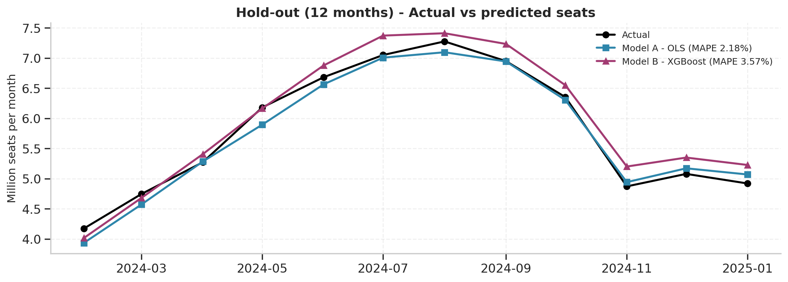

## 5.6. Síntesis comparativa final

La Tabla 5.4 resume los principales modelos del trabajo con sus respectivos MAPE sobre el hold-out de los últimos doce meses, agrupados por capítulo.

**Tabla 5.4. Ranking consolidado final por MAPE.**

| Modelo | Objetivo | Cuaderno | MAPE |
|:---|:---|:---:|---:|
| LSTM-direct12 V2* | Pernoctaciones (YoY) | NB07 | **4,36 %** |
| LSTM-1step V2 | Pernoctaciones (YoY) | NB07 | 4,71 % |
| XGB-noCOVID | Pernoctaciones | NB07 | 5,83 % |
| XGB-Original (M3) | Pernoctaciones | NB07 | 5,96 % |
| SARIMA(1,1,1)(1,1,1)₁₂ | Pernoctaciones | NB05 | 6,00 % |
| SARIMAX(1,1,1)(1,1,1)₁₂ | Pernoctaciones | NB05 | 6,60 % |
| RF M3-NoLag1 | Pernoctaciones | NB06 | 6,30 % |
| XGB M3-NoLag1 | Pernoctaciones | NB06 | 7,00 % |
| Naive Seasonal | Pernoctaciones | NB05 | 9,10 % |
| Modelo B (XGBoost) | Capacidad aérea | NB09 | 1,77 % |
| Naive Seasonal | Capacidad aérea | NB09 | 1,82 % |
| Modelo A (OLS log-log) | Capacidad aérea | NB09 | 2,01 % |

**Modelo ganador en MAPE pero con sensibilidad estructural a inputs macroeconómicos despreciable; véase Sección 5.3.7.*


Holt-Winters se excluye del ranking por ser una solución degenerada (Sección 5.1). Los MAPE de los modelos de capacidad aérea (NB09) son notablemente más bajos que los de los modelos de pernoctaciones porque la serie de capacidad es estructuralmente más suave y predecible —la capacidad se programa con antelación y cambia menos abruptamente que la demanda turística observada— por lo que no son directamente comparables con los de las demás filas.

---

# Capítulo 6. Conclusiones y trabajo futuro

Este capítulo está deliberadamente concebido como **autocontenido**: presenta las conclusiones del trabajo de manera que un lector pueda saltar directamente desde el Capítulo 2 (donde se enuncian los objetivos) hasta este capítulo final, y aún así comprender qué se ha hecho, qué se ha aprendido y qué queda por hacer. Se evitan, por ello, los porcentajes específicos y las gráficas, que pertenecen al Capítulo 5; el énfasis aquí está en la extracción de información y en la valoración honesta de logros, limitaciones y posibles extensiones.

## 6.1. Conclusiones

### 6.1.1. Sobre el cumplimiento de los objetivos

El trabajo ha cubierto los cinco objetivos específicos enunciados en el Capítulo 2 sin excepciones. El análisis descriptivo comparativo de Polonia frente a sus mercados emisores se completó en los cuadernos iniciales del trabajo; los indicadores derivados clave, incluyendo el precio turístico relativo de la literatura, se construyeron mediante un *pipeline* reproducible; la modelización del impacto de cada variable sobre los flujos turísticos se abordó mediante el esquema de cuatro especificaciones de complejidad decreciente, que cuantifica empíricamente la contribución de cada bloque informacional una vez resueltos los problemas de endogeneidad; la batería progresiva de modelos predictivos se implementó cubriendo las tres familias previstas en la propuesta —clásicos, aprendizaje automático y aprendizaje profundo— y se enriqueció con métodos bayesianos para inferencia causal; y, finalmente, el sistema de predicción bajo escenarios alternativos se construyó alimentándolo con proyecciones del FMI bajo trayectorias tendencial, optimista y pesimista, incluyendo el módulo aplicado de *Airline Capacity Prediction* contemplado en el último objetivo específico de la propuesta. A estos cinco objetivos se sumó una contribución metodológica no prevista pero que enriqueció sustancialmente el trabajo: la formulación del objetivo del modelo recurrente como tasa de variación interanual, decisión que resultó ser una de las aportaciones más relevantes del proyecto y se describe en el Capítulo 5.

### 6.1.2. La principal contribución metodológica

Si el trabajo dejase a la comunidad un único hallazgo metodológico, éste sería la **demostración empírica de la fuerza de la formulación interanual en redes recurrentes aplicadas a series con cambio estructural**. La transformación, conceptualmente sencilla, descompone la serie en una forma estacional estable —que la red aprende— y un nivel cambiante —que se queda en el denominador observado y se reintroduce automáticamente al rescalar la predicción—. La magnitud de la mejora obtenida sobre la formulación en niveles es lo bastante grande como para que no pueda atribuirse a azar ni a optimización de hiperparámetros: viene del cambio de representación del objetivo, no del modelo. 

La revisión bibliográfica realizada en el marco del trabajo identifica varias aproximaciones documentadas para tratar shocks estructurales en series temporales estacionales: la detección formal de breakpoints (Bai y Perron, 2003; Hall, 2025), los modelos de cambio de régimen tipo Markov-switching (Lardic y Mignon, 2003), la descomposición flexible de tendencia con métodos bayesianos estructurales (Doornik et al., 2021) y el tratamiento del shock como sucesión de outliers en procedimientos de ajuste estacional automatizado. En el ámbito específico del tourism forecasting post-COVID, los estudios consultados (Polyzos et al., 2021; Hsieh, 2021; Salamanis et al., 2022) responden al cambio estructural mayoritariamente mediante modelos híbridos CNN-LSTM o incorporando datos alternativos como Google Trends, manteniendo la formulación del objetivo en niveles absolutos. La transformación del objetivo del modelo recurrente a tasa de variación interanual, tal y como se ha implementado en el presente trabajo, no se ha encontrado documentada de forma sistemática en la literatura específica del tourism forecasting consultada, aunque comparte fundamentación conceptual con prácticas operativas del ámbito de la logística y la planificación de retail (Opex Analytics, 2020). La magnitud de la mejora obtenida sobre la formulación en niveles es lo bastante grande como para que no pueda atribuirse a azar ni a optimización de hiperparámetros: viene del cambio de representación del objetivo, no del modelo. Esta lección es generalizable a otras series temporales con cambios de nivel estructurales —shocks pandémicos, crisis financieras, reformas regulatorias— y constituye una recomendación de diseño con potencial de impacto más allá del caso polaco.


### 6.1.3. La distinción entre predicción y explicación

Una segunda lección, formulada de manera particularmente clara en el cuaderno NB09 y resumida en una frase que mereció destacarse durante la fase de validación con el tutor académico, es que **la mejor predicción no es necesariamente la mejor explicación**. Un modelo que predice excepcionalmente bien no proporciona, por ese solo hecho, una comprensión causal de los mecanismos subyacentes. El modelo de capacidad aérea del NB09 ilustra este principio con claridad: su capacidad predictiva es alta porque la inercia del propio ciclo de planificación captura la mayor parte de la varianza; el coeficiente del PIB, que es la pieza interpretable de la fórmula, presenta significación marginal y un R² bajo. El modelo es valioso como instrumento de simulación de escenarios, pero no debe presentarse como una explicación causal del comportamiento de las aerolíneas. Esta distinción, aparentemente sutil, resulta crucial para la honestidad académica del trabajo y para su uso responsable en contextos aplicados. Como subrayó el tutor académico durante la fase de validación de los resultados, "la mejor predicción no es necesariamente la mejor explicación; una buena predicción no implica causalidad".


### 6.1.4. La distinción entre objetivo académico y objetivo operativo

Una tercera lección, articulada a lo largo de todo el trabajo, es que la **especificación óptima de un modelo depende del objetivo perseguido**. Para la inferencia académica sobre los determinantes de la demanda turística, los retardos autorregresivos de corto plazo son informativos y deben mantenerse, ya que la autocorrelación es un fenómeno bien documentado y útil para modelar la inercia de la serie. Para la predicción operativa orientada a la toma de decisiones, esos mismos retardos resultan inútiles porque representan información no disponible en el momento de decidir. El esquema de cuatro especificaciones de complejidad decreciente del cuaderno NB06 cuantifica explícitamente este coste y proporciona a un usuario del modelo el dato honesto de cuánta precisión pierde a cambio de operar con información disponible. Este principio debería formar parte del vocabulario estándar de la práctica aplicada del *forecasting*, y este trabajo proporciona evidencia empírica de su importancia cuantitativa.

### 6.1.5. La complementariedad entre predicción y sensibilidad estructural

Una cuarta lección, manifestada al combinar los cuadernos NB07 y NB08, es que los **modelos calibrados para precisión predictiva tienden a perder sensibilidad estructural** a las variables macroeconómicas. El LSTM del trabajo, deliberadamente diseñado para minimizar el ruido macroeconómico, alcanza precisión predictiva alta pero responde mínimamente a los cambios de escenario en el ejercicio prospectivo. La respuesta metodológica adoptada —combinar el LSTM como instrumento central con un benchmark de elasticidad de la literatura como instrumento de sensibilidad— es defendible y produce resultados internamente consistentes (ambos métodos convergen en orden de magnitud) pero abre una pregunta de fondo para trabajos futuros: cómo diseñar modelos predictivos que mantengan simultáneamente alta precisión y alta sensibilidad estructural.

### 6.1.6. El valor de la inferencia causal complementaria

El análisis causal mediante *CausalImpact* aporta al trabajo una dimensión que ningún modelo predictivo, por sofisticado que sea, podría haber proporcionado por sí solo: una **estimación cuantitativa, con intervalo de credibilidad, del impacto contrafactual del COVID-19 sobre el turismo polaco**. La cifra resultante, expresada en millones de pernoctaciones acumuladas perdidas, no es la respuesta a la pregunta *"¿cuánto cayó el turismo en 2020?"* —que es una comparación ingenua frente al año anterior— sino a la pregunta más profunda *"¿cuánto habría sido el turismo en ausencia del shock, y cuál es la diferencia con lo que efectivamente ocurrió?"*. Esta forma de razonamiento causal contrafactual es de creciente importancia en la economía aplicada y enriquece el trabajo con un componente complementario al análisis predictivo dominante.

### 6.1.7. Sobre la orientación aplicada del trabajo

El trabajo no es solo una contribución metodológica; es también una herramienta. Los dos módulos aplicados —el pipeline prospectivo bajo escenarios del FMI y el modelo de capacidad aérea— están diseñados para ser usados, no solo leídos. La fórmula cerrada del Modelo A del cuaderno NB09, con su único parámetro interpretable, está pensada para que un economista del sector aéreo pueda incorporarla a sus propios análisis de planificación sin necesidad de comprender los detalles arquitecturales de las redes recurrentes que la complementan. Esta versatilidad comunicativa, que produce salidas adaptadas tanto al lector académico como al lector profesional, es un valor del trabajo que se desea destacar.

## 6.2. Limitaciones

Esta sección se permite mayor extensión que las anteriores porque reconocer las limitaciones honestamente es una de las condiciones esenciales de un trabajo riguroso. Las limitaciones se agrupan en cinco categorías.

**Limitaciones de los datos.** La principal limitación de los datos es la imposibilidad de desagregar las pernoctaciones extranjeras por país de origen, debido a que el conjunto Eurostat `tour_occ_nim` solo distingue tres categorías agregadas en su variable de residencia. Esta limitación obliga a modelar la serie agregada de pernoctaciones extranjeras y a incorporar la dimensión de los mercados emisores únicamente a través de variables exógenas ponderadas. Si Eurostat publicase desglose por país de origen en algún momento, sería posible modelar pernoctaciones por pareja origen-destino, lo que permitiría identificar elasticidades específicas por mercado y posiblemente revelaría heterogeneidades importantes que el modelo agregado no puede capturar. Una segunda limitación de los datos es que las series macroeconómicas de Eurostat se publican con un retraso de dos a cuatro meses respecto al mes de referencia, lo que produce huecos al final del panel que han debido cubrirse mediante imputación por arrastre del último valor publicado. Aunque este procedimiento es estándar para variables que cambian lentamente, introduce ruido en los meses finales que no se puede cuantificar de manera estricta.

**Limitaciones del tamaño muestral.** Tras la exclusión del período COVID, el conjunto de entrenamiento de las redes recurrentes se reduce aproximadamente a 150 secuencias, una muestra modesta para un modelo de la complejidad de una LSTM. Los regularizadores adoptados —*dropout* sustancial, *early stopping* sobre la base de pérdida de validación, arquitectura pequeña— mitigan pero no eliminan el riesgo de sobreajuste. Más significativamente, el bloque post-COVID disponible al final del panel es de apenas dos años, lo que limita la capacidad del modelo para aprender la dinámica del nuevo régimen. La cuestión solo se resolverá con el paso del tiempo, conforme se acumule más historia post-pandémica. Esta limitación afecta también a los tests de Diebold-Mariano, que en muchos pares no alcanzan significación estadística por el reducido número de forecasts solapados.

**Limitaciones de la metodología prospectiva.** Los escenarios del cuaderno NB08 se construyen mediante shifts fijos de ±2 puntos porcentuales sobre el baseline del FMI, una simplificación deliberada que no refleja la distribución probabilística real de los riesgos macroeconómicos. Un análisis más sofisticado utilizaría la propia evaluación de riesgos al alza y a la baja que el FMI publica en cada *release* del *World Economic Outlook*, ponderando los escenarios por sus probabilidades estimadas. Adicionalmente, el LSTM utilizado en el pipeline prospectivo es estructuralmente poco sensible a los cambios de escenario macroeconómico, por las razones discutidas en el Capítulo 5. La respuesta adoptada —complementar el LSTM con un benchmark de elasticidad de la literatura— es defendible pero introduce un trade-off entre precisión predictiva y sensibilidad estructural que un modelo único, calibrado explícitamente para ambos objetivos, podría idealmente evitar.

**Limitaciones del análisis causal.** El análisis *CausalImpact* del COVID emplea la serie `seats_lag6` y las dummies estacionales como controles. La elección del retardo de seis meses mitiga el problema de simultaneidad —las aerolíneas no podían ajustar su capacidad mensual de forma instantánea al shock— pero no lo elimina por completo, dado que las decisiones de capacidad durante 2020–2022 estaban claramente influidas por el colapso de demanda. Una versión más rigurosa del análisis utilizaría como contrafactual datos de un país comparable no afectado por el shock, lo que no es trivial en el caso del COVID-19 al tratarse de una pandemia global. Adicionalmente, el intervalo de credibilidad del efecto acumulado reportado en el trabajo se calcula como suma acumulada de los intervalos puntuales, una aproximación que asume independencia entre errores y tiende a ampliar ligeramente las bandas respecto a una simulación posterior bayesiana completa. La cifra puntual del efecto acumulado no se ve afectada por esta aproximación; solo se ve afectada la amplitud del intervalo.

**Limitaciones del modelo aplicado.** El modelo del cuaderno NB09 utiliza un único regresor macroeconómico (el PIB ponderado de los emisores con retardo de 12 meses) y por tanto está expuesto a sesgo de variable omitida, como reconoció el tutor académico durante la fase de validación. Se intentó una especificación multivariante que incluyera tipo de cambio, precio relativo y confianza del consumidor, pero los resultados fueron peores debido a la limitada variación de las macroeconómicas en la muestra ex-COVID disponible. La elasticidad estimada para el PIB debe interpretarse como asociación reducida en forma, no como elasticidad causal estructural. Adicionalmente, el modelo tiene poder predictivo apenas superior al de un benchmark naive estacional, lo que limita su utilidad como predictor puro y refuerza su uso como instrumento de simulación de escenarios.

## 6.3. Trabajo futuro

Varias líneas de extensión del trabajo son inmediatamente identificables y se enumeran a continuación en orden aproximado de relevancia.

**Ampliación geográfica del marco metodológico.** El esquema metodológico desarrollado para Polonia es directamente aplicable a otros países de Europa del Este con dinámicas comparables, como Chequia, Hungría o Rumanía. Una comparación sistemática entre varios países permitiría evaluar la generalizabilidad de las conclusiones del trabajo, especialmente las relativas a la robustez de la formulación interanual y a la persistencia de las propiedades del shock COVID.

**Granularidad del objetivo.** Si Eurostat publicase desglose por país de origen en su conjunto de pernoctaciones, sería posible modelar parejas origen-destino con elasticidades específicas por mercado, lo que podría revelar heterogeneidades importantes que el modelo agregado no captura. Alternativamente, fuentes complementarias como datos de teléfonos móviles agregados, búsquedas de Google Trends, o reservas de plataformas como Airbnb pueden aproximar esta desagregación si se logran integrar consistentemente con las estadísticas oficiales.

**Arquitecturas avanzadas de aprendizaje profundo.** El trabajo se ha limitado a la arquitectura LSTM por su consolidación en la literatura. Extensiones naturales incluyen arquitecturas BiLSTM, mecanismos de atención, o modelos basados en *transformers* aplicados a series temporales. La advertencia documentada en el Capítulo 2 sobre la sensibilidad de las redes recurrentes a tamaños muestrales pequeños probablemente se acentúa con arquitecturas más complejas, por lo que su exploración debería ir acompañada de validación cruzada cuidadosa.

**Cuantificación rigurosa de la incertidumbre.** Todos los modelos del trabajo producen predicciones puntuales o, en el caso del análisis causal, intervalos de credibilidad bayesianos. Una extensión natural es producir intervalos de predicción bien calibrados para todos los modelos, mediante técnicas como *conformal prediction*, predicción cuantílica o *ensembles* probabilísticos. Esta línea es especialmente relevante en el contexto del módulo prospectivo del FMI, donde la cuantificación honesta de la incertidumbre es esencial para la toma de decisiones aplicadas.

**Integración de datos alternativos de alta frecuencia.** Los modelos del trabajo utilizan exclusivamente fuentes oficiales con frecuencia mensual. La incorporación de datos alternativos —búsquedas web, *trackers* de movilidad, reservas hoteleras en tiempo real, datos meteorológicos— podría enriquecer la capacidad predictiva, especialmente en horizontes cortos donde la información reciente es valiosa. Esta línea requiere resolver el problema del *nowcasting* (predicción del presente y del pasado inmediato) con datos publicados a distintas frecuencias y latencias.

**Modelos de capacidad aérea con mayor granularidad.** El modelo del cuaderno NB09 predice asientos agregados a nivel país. Una extensión inmediata es la desagregación por aeropuerto (Varsovia, Cracovia, Gdańsk, Katowice) o por ruta específica origen-destino, lo que requeriría integrar datos de programación de vuelos como los publicados por OAG o Cirium. La granularidad por aeropuerto sería de particular utilidad para la planificación de infraestructura, mientras que la granularidad por ruta sería esencial para las decisiones de programación de aerolíneas.

**Análisis de la dimensión sostenibilidad.** El trabajo se ha centrado en la dimensión cuantitativa del turismo (cuántas pernoctaciones, cuántos asientos). Una extensión interesante incorporaría la dimensión de impacto, midiendo emisiones de CO₂ asociadas a las trayectorias de capacidad bajo los distintos escenarios. Esta línea conectaría el trabajo con los Objetivos de Desarrollo Sostenible 12 y 13, particularmente con el debate sobre el dimensionamiento sostenible del crecimiento turístico.

## 6.4. Uso de la inteligencia artificial

De acuerdo con la normativa de la Escuela de Ingeniería Informática, se declara de forma explícita el uso que se ha hecho de herramientas de inteligencia artificial generativa en la elaboración del presente Trabajo de Fin de Grado.

**Ámbitos de uso.** La inteligencia artificial, específicamente modelos de lenguaje de tipo asistente conversacional, se ha utilizado en tres ámbitos principales. En primer lugar, como **asistencia en programación**: generación y depuración de código Python para los cuadernos Jupyter, incluyendo manipulación con `pandas`, implementación de modelos con `scikit-learn`, `XGBoost` y `TensorFlow/Keras`, visualización con `matplotlib` y `seaborn`, y tests estadísticos con `scipy` y `statsmodels`. Todas las decisiones sobre qué código implementar, cómo diseñar los experimentos y cómo interpretar los resultados han sido tomadas por el autor; la IA ha actuado como herramienta de productividad, no como decisor. En segundo lugar, como **apoyo en la estructuración y redacción** de la memoria: organización de secciones, mejora de la claridad expositiva, revisión de coherencia entre capítulos. Todos los hallazgos, decisiones metodológicas, hipótesis, interpretaciones y conclusiones son responsabilidad exclusiva del autor. En tercer lugar, como **apoyo en la localización de referencias bibliográficas**: búsqueda y verificación de DOIs y detalles editoriales. Todas las referencias citadas han sido leídas, contrastadas e incorporadas por el autor.

**Ámbitos explícitamente excluidos.** La inteligencia artificial **no** ha tomado decisiones metodológicas autónomas. La selección de variables, la definición de las cuatro especificaciones del cuaderno NB06, el diagnóstico de endogeneidad, la estrategia de tratamiento del COVID en el LSTM, la decisión de reformular el objetivo como tasa interanual, el diseño del pipeline del NB08, la elección de los dos modelos paralelos en el NB09, y todas las decisiones técnicas del trabajo son del autor, tomadas con el asesoramiento del tutor académico y del tutor externo. Los resultados numéricos son producto de la ejecución del código sobre los datos reales, no generados por la IA.

**Trazabilidad y reproducibilidad.** El código completo del trabajo está disponible en el repositorio público del proyecto en GitHub, lo que permite la verificación independiente de todos los resultados reportados.

---

# Bibliografía

Athanasopoulos, G., Hyndman, R. J., Song, H. y Wu, D. C. (2011). The tourism forecasting competition. *International Journal of Forecasting*, 27(3), 822–844.

Bai, J. y Perron, P. (2003). Computation and analysis of multiple structural change models. Journal of Applied Econometrics, 18(1), 1–22.

Box, G. E. P. y Jenkins, G. M. (1976). *Time Series Analysis: Forecasting and Control*. Holden-Day.

Breiman, L. (2001). Random Forests. *Machine Learning*, 45(1), 5–32.

Brodersen, K. H., Gallusser, F., Koehler, J., Remy, N. y Scott, S. L. (2015). Inferring causal impact using Bayesian structural time-series models. *The Annals of Applied Statistics*, 9(1), 247–274.

Chen, J., Ying, Z., Zhang, C. y Balezentis, T. (2024). Forecasting tourism demand with search engine data: A hybrid CNN-BiLSTM model based on Boruta feature selection. *Information Processing & Management*, 61(3), 103699.

Chen, T. y Guestrin, C. (2016). XGBoost: A scalable tree boosting system. *Proceedings of the 22nd ACM SIGKDD International Conference on Knowledge Discovery and Data Mining*, 785–794.

Crouch, G. I. (1994). The study of international tourism demand: A survey of practice. *Journal of Travel Research*, 32(4), 41–54.

Crouch, G. I. (1995). A meta-analysis of tourism demand. *Annals of Tourism Research*, 22(1), 103–118.

Diebold, F. X. y Mariano, R. S. (1995). Comparing predictive accuracy. *Journal of Business & Economic Statistics*, 13(3), 253–263.

Doornik, J. A., Castle, J. L. y Hendry, D. F. (2021). Modeling and forecasting the COVID-19 pandemic time-series data. Social Science Quarterly, 102(5), 2070–2087.

Gunter, U. y Smeral, E. (2016). The decline of tourism income elasticities in a global context. *Tourism Economics*, 22(3), 466–483.

Hall, S. G. (2025). On the detection of structural breaks: The case of the COVID shock. Journal of Forecasting, advance online publication.

Harvey, D., Leybourne, S. y Newbold, P. (1997). Testing the equality of prediction mean squared errors. *International Journal of Forecasting*, 13(2), 281–291.

Hewamalage, H., Bergmeir, C. y Bandara, K. (2021). Recurrent Neural Networks for Time Series Forecasting: Current status and future directions. *International Journal of Forecasting*, 37(1), 388–427.

Hochreiter, S. y Schmidhuber, J. (1997). Long Short-Term Memory. Neural Computation, 9(8), 1735–1780.

Hoeting, J. A., Madigan, D., Raftery, A. E. y Volinsky, C. T. (1999). Bayesian model averaging: A tutorial. *Statistical Science*, 14(4), 382–417.

Huderek-Glapska, S. y Nowak, H. (2016). Development of regional airports in Poland. *Mediterranean Journal of Social Sciences*, 7(1S1), 308–315.

IATA (2024). *Worldwide Airport Slot Guidelines*, 10th edition. International Air Transport Association.

IMF (2025). *World Economic Outlook, April 2025*. International Monetary Fund.

Lardic, S. y Mignon, V. (2003). Cointégration entre les marchés boursiers internationaux: une approche en termes de cointégration fractionnaire. Économie et Prévision, 159(3), 65–81.

Li, G., Song, H. y Witt, S. F. (2005). Recent developments in econometric modeling and forecasting. *Journal of Travel Research*, 44(1), 82–99.

Office for National Statistics (2022). *Consumer Prices Indices Technical Manual*. ONS.

Peng, B., Song, H., Crouch, G. I. y Witt, S. F. (2015). A meta-analysis of international tourism demand elasticities. *Journal of Travel Research*, 54(5), 611–633.

Polyzos, S., Samitas, A. y Spyridou, A. E. (2021). Tourism demand and the COVID-19 pandemic: An LSTM approach. Tourism Recreation Research, 46(2), 175–187.

Reglamento (UE) n.º 692/2011 del Parlamento Europeo y del Consejo, de 6 de julio de 2011, relativo a las estadísticas europeas sobre el turismo. *Diario Oficial de la Unión Europea*, L 192/17.

Reglamento (UE) 2016/792 del Parlamento Europeo y del Consejo, de 11 de mayo de 2016, sobre los índices armonizados de precios de consumo. *Diario Oficial de la Unión Europea*, L 135/11.

Salamanis, A., Xanthopoulou, G., Kehagias, D. y Tzovaras, D. (2022). LSTM-based deep learning models for long-term tourism demand forecasting. *Electronics*, 11(22), 3681.

Scott, S. L. y Varian, H. R. (2014). Predicting the present with Bayesian structural time series. *International Journal of Mathematical Modelling and Numerical Optimisation*, 5(1/2), 4–23.

Song, H. y Li, G. (2008). Tourism demand modelling and forecasting — A review of recent research. *Tourism Management*, 29(2), 203–220.

Song, H., Li, G., Witt, S. F. y Fei, B. (2010). Tourism demand modelling and forecasting: How should demand be measured? *Tourism Economics*, 16(1), 63–81.

Song, H., Qiu, R. T. R. y Park, J. (2019). A review of research on tourism demand forecasting: Launching the *Annals of Tourism Research* Curated Collection on tourism demand forecasting. *Annals of Tourism Research*, 75, 338–362.

Song, H., Witt, S. F. y Li, G. (2009). *The Advanced Econometrics of Tourism Demand*. Routledge.

Wooldridge, J. M. (2010). *Econometric Analysis of Cross Section and Panel Data* (2nd ed.). MIT Press.

WTTC (2025). *Travel & Tourism Economic Impact 2025*. World Travel & Tourism Council.


### Fuentes de datos primarias

Eurostat_a (`tour_occ_nights`): Nights spent at tourist accommodation establishments — monthly data. https://ec.europa.eu/eurostat/databrowser/view/tour_occ_nim/default/table


Eurostat. `tour_cap_nat`: Tourism infrastructure capacity at national level. https://ec.europa.eu/eurostat/databrowser/view/tour_cap_nats/default/table?lang=en

Eurostat. `tour_lfsq6r2`: Employment in the tourism industries. https://ec.europa.eu/eurostat/databrowser/view/tour_lfsq6r2/default/table?lang=en

Eurostat_d (`avia_paoc`): Air passenger transport between reporting countries — monthly data. https://ec.europa.eu/eurostat/databrowser/view/avia_paoc__custom_20358287/default/table

Eurostat_h (`avia_tf_aca`): Air transport of passengers, seats and flights — Poland, monthly data. https://ec.europa.eu/eurostat/databrowser/view/avia_tf_aca/default/table?lang=en

Eurostat. `avia_tf_apal`: Air passenger transport by reporting airport, Poland. https://ec.europa.eu/eurostat/databrowser/view/avia_tf_apal__custom_20358308/default/table


Eurostat_e (`prc_hicp_midx`): Harmonised Index of Consumer Prices — monthly data, 2015=100. https://ec.europa.eu/eurostat/databrowser/view/prc_hicp_minr__custom_21540143/bookmark/table?lang=en&bookmarkId=60ebcdf2-9eb8-4901-b98e-46b62b318ea4&c=1779283184000

Eurostat. `prc_hicp_aind`: HICP — annual data, specific inflation series. https://ec.europa.eu/eurostat/databrowser/view/prc_hicp_aind__custom_20358090/default/table

Eurostat. `prc_ppp_ind`: Price level indices — Purchasing Power Parities. https://ec.europa.eu/eurostat/databrowser/view/prc_ppp_ind/default/table?lang=en

Eurostat_f (`ert_bil_eur_m`): Euro/ECU exchange rates — bilateral, monthly (EUR/PLN, EUR/USD). https://ec.europa.eu/eurostat/databrowser/view/ert_bil_eur_m__custom_20357228/default/table

Eurostat_b (`namq_10_gdp`): GDP and main components — quarterly data, both current prices (market prices) and real GDP (CLV-2010). https://ec.europa.eu/eurostat/databrowser/view/namq_10_pc__custom_20251885/default/table


Eurostat_c (`demo_pjan`): Population on 1 January by age and sex. https://ec.europa.eu/eurostat/databrowser/view/demo_pjan__custom_20338176/default/table

Eurostat_g (`ei_bsco_m`): Consumer confidence indicator — monthly data. https://ec.europa.eu/eurostat/databrowser/view/ei_bsco_m__custom_20356869/default/table

Office for National Statistics (ONS). Series D7BT (HICP CPIH), ABMI (GDP at constant prices) and UKPOP (population estimates). https://www.ons.gov.uk/

International Monetary Fund. World Economic Outlook Database, April 2025 release. https://www.imf.org/external/datamapper/datasets

UN Tourism (UNWTO). International tourism — inbound arrivals and inbound tourism expenditure (December 2025 release). https://www.unwto.org/

Our World in Data. GDP by world regions — stacked-area dataset (compiled from World Bank and Maddison Project). https://ourworldindata.org/

---

# Glosario

**ADF (Augmented Dickey-Fuller).** Test estadístico para diagnosticar estacionariedad en series temporales. La hipótesis nula es la presencia de raíz unitaria; rechazarla implica que la serie es estacionaria.

**Backtest de ventana expansiva.** Esquema de validación temporal en el que el modelo se reentrena en sucesivos orígenes a lo largo de la serie histórica, evaluando en cada origen las predicciones a múltiples horizontes contra los valores observados.

**BSTS (Bayesian Structural Time Series).** Familia de modelos bayesianos que descomponen una serie temporal en tendencia, estacionalidad y componente de regresión, con selección de variables mediante priors de tipo *spike-and-slab*.

**CausalImpact.** Marco metodológico desarrollado por Brodersen et al. (2015) para estimar el impacto causal contrafactual de una intervención en una serie temporal, basado en un modelo BSTS entrenado sobre el período pre-intervención.

**Chain-linking (encadenamiento estadístico).** Procedimiento para combinar series temporales procedentes de fuentes distintas en un punto de solapamiento, ajustando los niveles mediante un factor de escala y preservando las tasas de crecimiento de cada fuente fuera del período común.

**CCI (Consumer Confidence Indicator).** Indicador de confianza del consumidor publicado por la Comisión Europea, considerado un indicador adelantado del gasto de los hogares.

**CRISP-DM (Cross-Industry Standard Process for Data Mining).** Metodología estándar para proyectos de ciencia de datos estructurada en seis fases iterativas: comprensión del negocio, comprensión de los datos, preparación, modelado, evaluación y despliegue.

**Diebold-Mariano (test).** Test estadístico formal para comparar la precisión predictiva de dos modelos sobre un conjunto común de predicciones. Se aplica habitualmente con la corrección de Harvey-Leybourne-Newbold para mitigar el sesgo en muestras pequeñas.

**Dummy (variable ficticia).** Variable binaria que toma el valor 1 en presencia de una condición y 0 en su ausencia. En este trabajo se emplean dummies para identificar el régimen COVID y las componentes estacionales mensuales.

**Endogeneidad.** Situación en la que una variable explicativa está correlacionada con el término de error del modelo, típicamente por causación recíproca con el objetivo. En este trabajo, la capacidad aérea contemporánea es endógena respecto a la demanda turística.

**GDP (Gross Domestic Product).** Producto Interior Bruto. Medida estándar de la producción económica agregada de un país.

**Granger causality.** Relación estadística según la cual los valores pasados de una variable X ayudan a predecir los valores presentes de una variable Y más allá de lo que predicen los valores pasados de Y. No implica causalidad económica en sentido estricto.

**HICP (Harmonised Index of Consumer Prices).** Índice Armonizado de Precios al Consumo, calculado con metodología uniforme en toda la Unión Europea conforme al Reglamento (UE) 2016/792.

**Hold-out.** Esquema simple de validación en el que se reserva una porción final de la serie histórica como conjunto de prueba sobre el que se evalúa el modelo entrenado con el resto.

**KPSS (Kwiatkowski-Phillips-Schmidt-Shin).** Test estadístico complementario al ADF; rechazar la hipótesis nula indica ausencia de estacionariedad.

**LCC (Low-Cost Carrier).** Aerolínea de bajo coste, con un modelo de negocio basado en la minimización de costes operativos. Ryanair y Wizz Air son los principales LCC operando en el mercado polaco.

**LSTM (Long Short-Term Memory).** Arquitectura de red neuronal recurrente diseñada para capturar dependencias temporales de largo plazo mediante un sistema de puertas que regula la persistencia de información a lo largo del tiempo.

**MAE (Mean Absolute Error).** Error absoluto medio. Promedio de las diferencias en valor absoluto entre predicciones y observaciones.

**MAPE (Mean Absolute Percentage Error).** Error porcentual absoluto medio. Métrica de precisión expresada como porcentaje, particularmente útil por su interpretabilidad.

**ODS.** Objetivos de Desarrollo Sostenible de las Naciones Unidas, conjunto de diecisiete metas globales adoptadas en 2015.

**OLS (Ordinary Least Squares).** Mínimos cuadrados ordinarios. Procedimiento estándar de estimación de modelos de regresión lineal.

**ONS (Office for National Statistics).** Instituto nacional de estadística del Reino Unido.

**Pernoctación.** Cada noche que un visitante (turista) pasa o paga por pasar en un alojamiento turístico, según la definición estadística europea. Es la variable objetivo principal del trabajo.

**PIP (Posterior Inclusion Probability).** En modelos bayesianos con selección de variables, probabilidad posterior de que una variable esté incluida en el modelo verdadero.

**PLN.** Złoty polaco, moneda oficial de la República de Polonia.

**Random Forest.** Algoritmo de aprendizaje automático basado en un *ensemble* de árboles de decisión entrenados sobre muestras *bootstrap* del conjunto de entrenamiento.

**RMSE (Root Mean Square Error).** Raíz del error cuadrático medio. Métrica de precisión que penaliza más los errores grandes que el MAE.

**SARIMA / SARIMAX.** Modelos autorregresivos integrados de media móvil con componente estacional, en su versión univariante (SARIMA) y con variables exógenas (SARIMAX).

**Slot aeroportuario.** Autorización para utilizar la infraestructura de un aeropuerto a una hora determinada, asignada conforme a las directrices IATA.

**VIF (Variance Inflation Factor).** Factor de inflación de la varianza. Métrica diagnóstica de multicolinealidad entre variables explicativas. Valores superiores a 5 se consideran indicio de colinealidad moderada y superiores a 10 de colinealidad problemática.

**WEO (World Economic Outlook).** Publicación periódica del Fondo Monetario Internacional con proyecciones macroeconómicas mundiales por país.

**XGBoost (eXtreme Gradient Boosting).** Algoritmo de aprendizaje automático basado en *gradient boosting* sobre árboles de decisión, optimizado para velocidad y rendimiento.

**YoY (Year-on-Year).** Variación interanual, calculada como diferencia o ratio entre el valor del período actual y el valor doce meses antes.

### Tabla A.1 — Acrónimos de variables empleadas en el panel

| Acrónimo | Descripción |
|---|---|
| `nights` | Pernoctaciones mensuales de turistas extranjeros en Polonia. Variable objetivo del trabajo. |
| `nights_lag1` | Pernoctaciones observadas un mes antes (retardo autorregresivo de corto plazo). |
| `nights_lag12` | Pernoctaciones observadas doce meses antes (retardo estacional). |
| `nights_yoy` | Crecimiento interanual de las pernoctaciones, definido como `nights[t] / nights[t-12]`. Objetivo del LSTM en la formulación V2. |
| `seats` | Asientos totales disponibles mensuales en aeropuertos polacos. |
| `seats_lag6` | Asientos disponibles seis meses antes; predeterminado por el horizonte estándar de asignación de slots IATA. |
| `gdp_origins_wavg` | PIB real trimestral interpolado mensualmente, ponderado por la cuota de pasajeros de los nueve mercados emisores. |
| `gdp_pc_origins_wavg` | PIB real per cápita ponderado de los mercados emisores. |
| `gdp_origins_lag3` | PIB ponderado de los emisores con retardo de tres meses (alineado con el pico de correlación cruzada). |
| `gdp_DE` | PIB real de Alemania, mercado emisor con mayor cuota. |
| `gdp_pc_DE` | PIB real per cápita de Alemania. |
| `pop_origins_wavg` | Población ponderada de los mercados emisores. |
| `hicp_PL` | Índice Armonizado de Precios al Consumo de Polonia (base 2015 = 100). |
| `hicp_origins_wavg` | HICP medio ponderado de los mercados emisores. |
| `hicp_ratio` | Ratio entre `hicp_PL` y `hicp_origins_wavg`. Indica el coste de vida relativo entre destino y origen. |
| `relprice_wavg` | Precio turístico relativo según Song et al. (2010), que combina HICP y tipos de cambio. |
| `exr_pln` | Tipo de cambio bilateral euro/złoty polaco (EUR/PLN). |
| `cci_DE` | Indicador de Confianza del Consumidor alemán publicado por la Comisión Europea. |
| `cci_DE_lag2` | CCI alemán con retardo de dos meses. |
| `covid_strong` | Variable ficticia que toma valor 1 entre marzo de 2020 y diciembre de 2021. Captura la fase aguda del shock pandémico. |
| `covid_post` | Variable ficticia que toma valor 1 desde enero de 2022. Captura el desplazamiento de nivel post-pandémico. |
| `month_01`, ..., `month_12` | Variables ficticias estacionales, una por cada mes del año. Toman valor 1 si la observación pertenece al mes correspondiente. |
| `trend` | Variable de tendencia lineal incremental, igual al número de meses transcurridos desde el origen del panel. |
