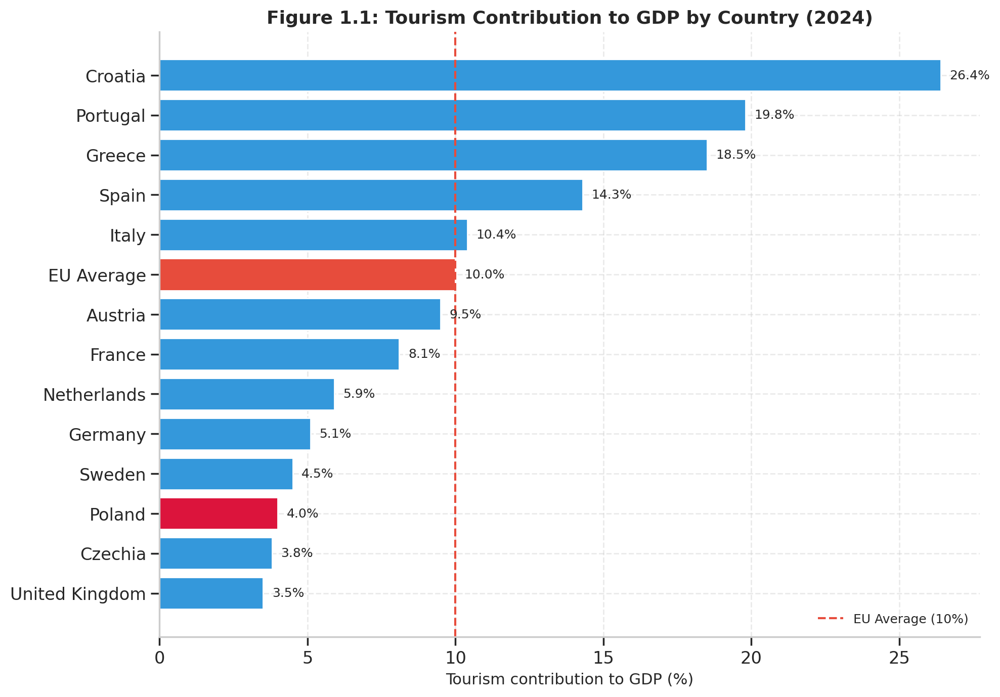
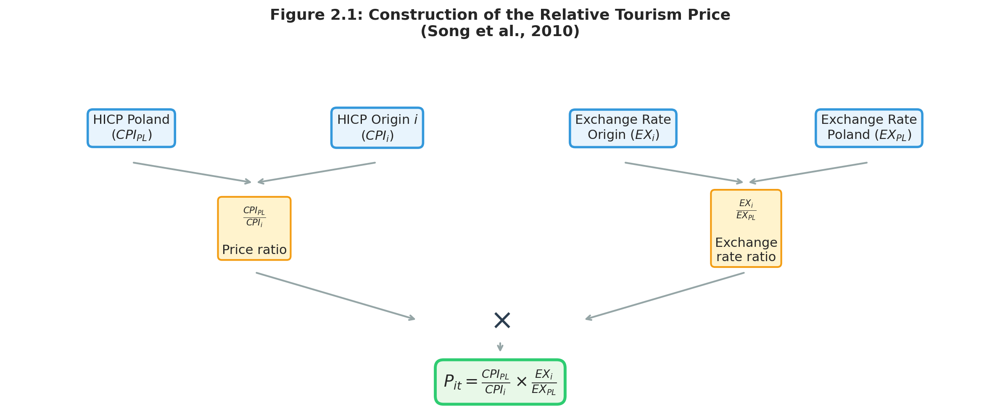
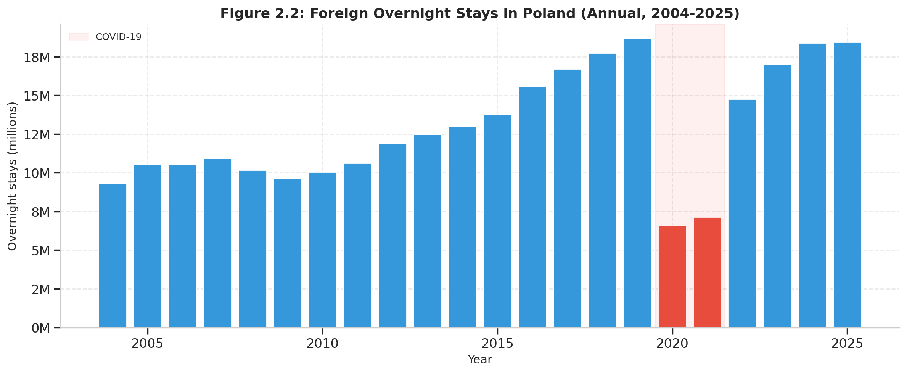
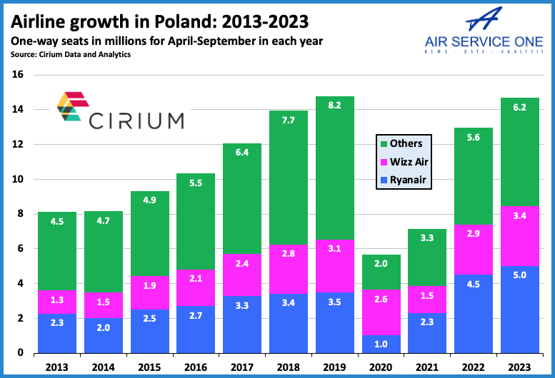
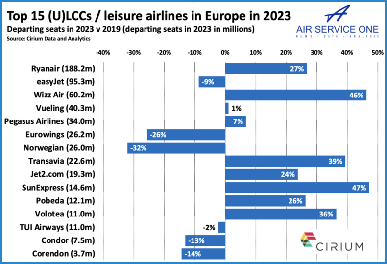
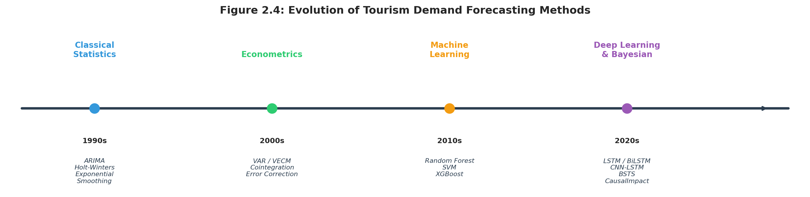
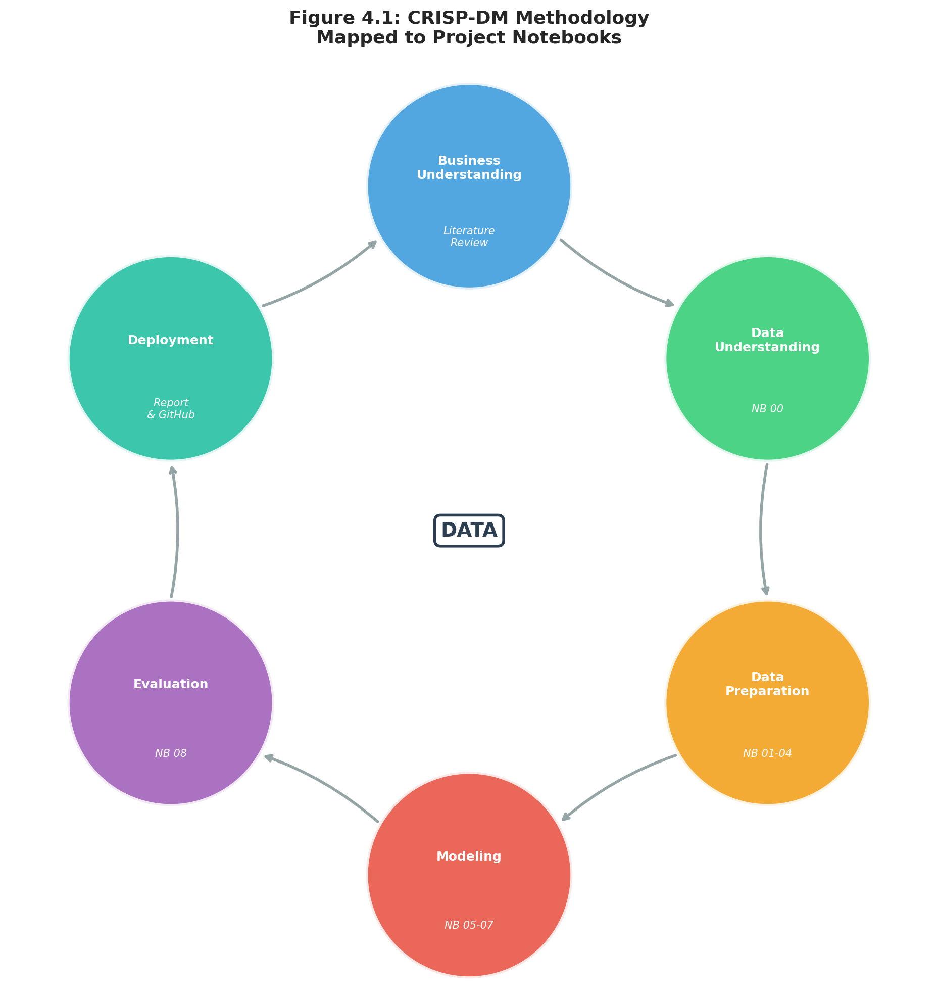
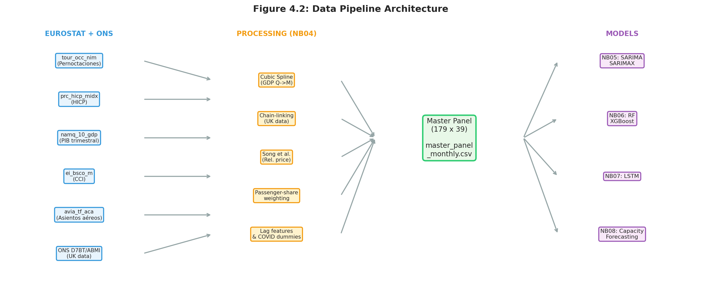
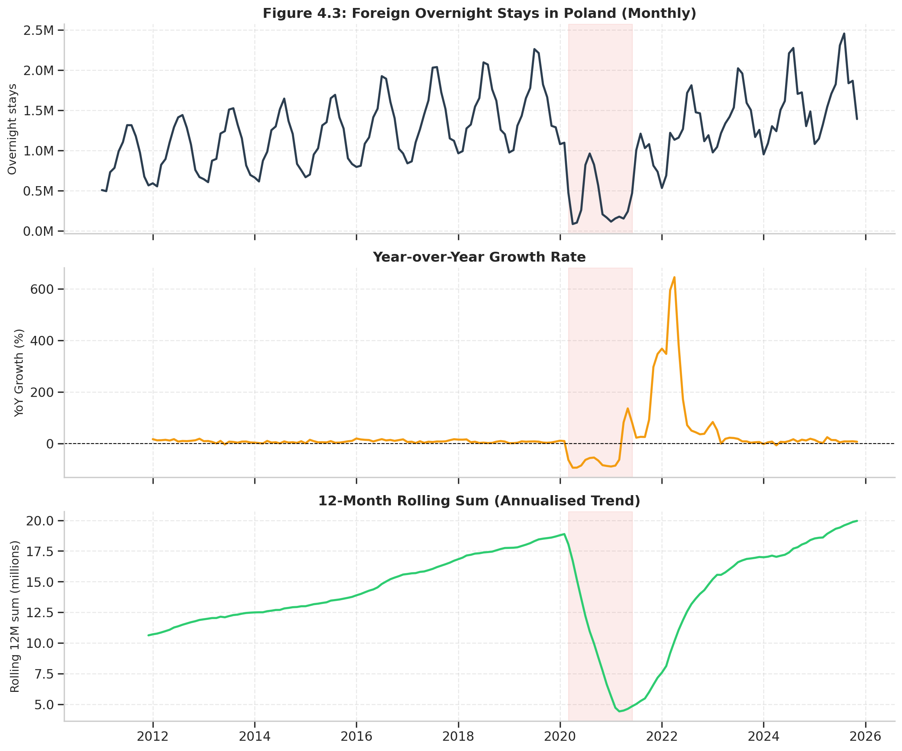
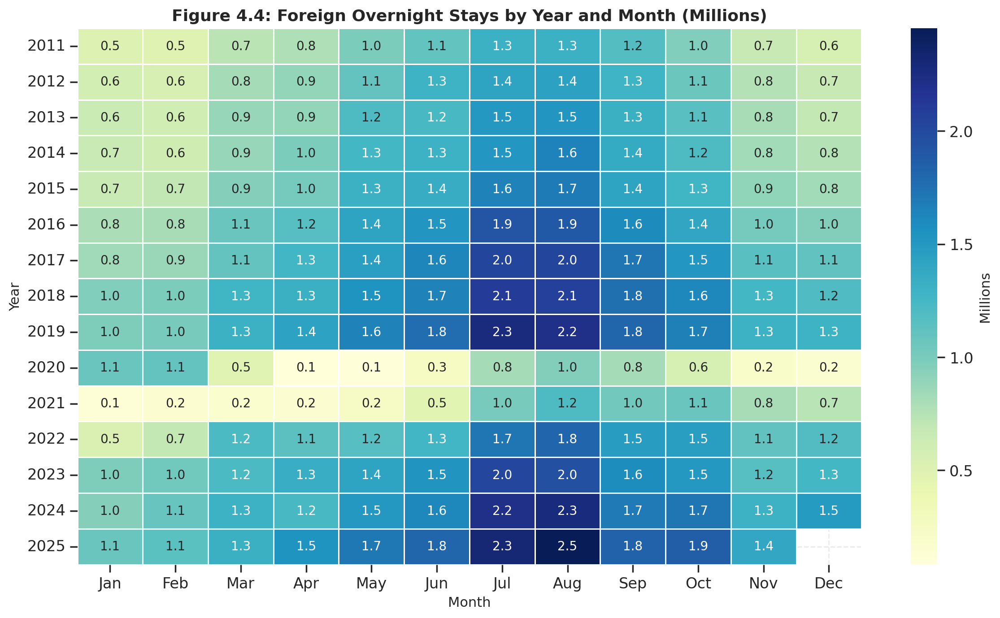

# Análisis y Modelización del Impacto del Crecimiento Aéreo y Económico de Polonia en los Flujos Turísticos Europeos

## Trabajo de Fin de Grado

**TITULACIÓN:** Grado en Ciencia e Ingeniería de Datos  
**AUTOR:** Diego Marrero Ferrera  
**TUTORIZADO POR:** Juan María Hernández Guerra
**Fecha:** Junio de 2026

Universidad de Las Palmas de Gran Canaria — Escuela de Ingeniería Informática (EII)

---

## Resumen

El presente Trabajo de Fin de Grado aborda la modelización y predicción de la demanda turística internacional en Polonia, medida como el número mensual de pernoctaciones de turistas extranjeros en establecimientos de alojamiento turístico. En las dos últimas décadas, Polonia se ha consolidado como una de las economías de mayor crecimiento en Europa, con un incremento quintuplicado del tráfico aeroportuario desde su adhesión a la Unión Europea en 2004 y un nivel de precios aproximadamente un 30 % inferior a la media comunitaria, convirtiéndola en un caso representativo del auge socioeconómico de Europa del Este.

El trabajo integra datos armonizados de Eurostat — índices de precios al consumo (HICP), tipos de cambio bilaterales, PIB real, indicadores de confianza del consumidor y capacidad aérea — procedentes de nueve mercados emisores europeos. Se sigue una metodología de complejidad creciente: modelos estadísticos clásicos (SARIMA, Holt-Winters), algoritmos de aprendizaje automático (*Random Forest*, *XGBoost*), redes neuronales recurrentes (LSTM con variables exógenas) y métodos bayesianos (*Bayesian Structural Time Series* y *Bayesian Model Averaging*). La evaluación comparativa emplea métricas estándar (RMSE, MAE, MAPE) y el test de Diebold-Mariano, complementada con un análisis de impacto causal del COVID-19 mediante el marco *CausalImpact*. 

Adicionalmente, el trabajo incorpora un enfoque de predicción bajo escenarios, en el que las proyecciones del modelo se condicionan a trayectorias futuras de variables macroeconómicas exógenas — como el PIB o la inflación — procedentes de fuentes internacionales como el *World Economic Outlook* del International Monetary Fund. Este enfoque permite generar estimaciones prospectivas de la demanda turística y de la capacidad aérea bajo distintos supuestos económicos, constituyendo una herramienta de especial relevancia para la toma de decisiones en el sector — particularmente para aerolíneas y operadores turísticos — al facilitar la planificación estratégica en horizontes temporales futuros.

**Palabras clave:** demanda turística, predicción de series temporales, Polonia, LSTM, SARIMA, estadística bayesiana, HICP, Eurostat, conectividad aérea, aviación, COVID-19.

---

## Abstract

This Bachelor's thesis addresses the modelling and forecasting of international tourism demand in Poland, measured as the monthly number of overnight stays by foreign tourists in tourist accommodation establishments. Over the past two decades, Poland has established itself as one of Europe's fastest-growing economies, with a fivefold increase in airport passenger traffic since its EU accession in 2004 and a price level approximately 30% below the EU average, making it a representative case of the economic and tourism boom in Eastern Europe.

The work integrates harmonised Eurostat data —consumer price indices (HICP), bilateral exchange rates, real GDP, consumer confidence indicators, and airline seat capacity— from nine European source markets. It follows a progressively complex approach: classical statistical models (SARIMA, Holt-Winters), machine learning algorithms (Random Forest, XGBoost), recurrent neural networks (LSTM with exogenous variables), and Bayesian methods (Bayesian Structural Time Series and Bayesian Model Averaging). The comparative evaluation employs standard metrics (RMSE, MAE, MAPE) and the Diebold-Mariano test, complemented by a causal impact analysis of COVID-19 using the CausalImpact framework. Additionally, forecasts are generated under alternative scenarios (baseline, optimistic, pessimistic) regarding the evolution of air connectivity and macroeconomic conditions.

Additionally, the study incorporates a scenario-based forecasting approach, in which model projections are conditioned on future trajectories of exogenous macroeconomic variables — such as GDP or inflation — sourced from international databases like the *World Economic Outlook* of the International Monetary Fund. This approach enables the generation of forward-looking estimates of tourism demand and air transport capacity under different economic assumptions, constituting a highly valuable tool for decision-making within the sector—particularly for airlines and tourism operators—by facilitating strategic planning over future time horizons.

**Keywords:** tourism demand, time series forecasting, Poland, LSTM, SARIMA, Bayesian statistics, HICP, Eurostat, air connectivity, aviation, COVID-19.

---

# Capítulo 1. Introducción

El turismo internacional constituye uno de los sectores económicos más relevantes a escala global. Según el Barómetro Mundial del Turismo publicado por Naciones Unidas (UN Tourism, 2025), las llegadas internacionales de turistas alcanzaron los 1.400 millones en 2024, suponiendo una recuperación prácticamente completa de los niveles previos a la pandemia de COVID-19. El Consejo Mundial de Viajes y Turismo (WTTC) estimó que la contribución total del sector al Producto Interior Bruto (PIB) mundial alcanzó los 10,9 billones de dólares — equivalentes al 10 % de la economía global — generando 357 millones de empleos (WTTC, 2025). En el ámbito europeo, el sector contribuyó con casi 1,8 billones de euros al PIB de la Unión Europea.

> *Gráfico de barras horizontales mostrando la contribución del sector turístico al PIB por país europeo. Destacar visualmente a Polonia (aprox. 4 %) frente a la media europea (10 %) y economías altamente dependientes como Croacia o España. Sirve para evidenciar el margen de crecimiento y la importancia estratégica de predecir la demanda para fomentar este sector. Fuente: Datos del WTTC 2025.*; https://wttc.org/research/economic-impact.

En este contexto de crecimiento, la capacidad de predecir con precisión la demanda turística adquiere una importancia estratégica fundamental. Los productos turísticos, tales como plazas hoteleras o asientos de avión, son altamente perecederos. Como señalaron Song y Li (2008), la predicción anticipada de la demanda permite mejorar la asignación de recursos escasos, afectando directamente a la planificación de infraestructuras, la programación de rutas aéreas y la gestión de la capacidad de alojamiento.

El presente Trabajo de Fin de Grado (TFG) se enmarca en el ámbito de la ciencia e ingeniería de datos aplicada a fenómenos socioeconómicos, tomando como caso de estudio a Polonia. Desde su adhesión a la Unión Europea, el país ha experimentado una transformación demográfica y estructural sin precedentes, consolidándose como un mercado emisor y receptor emergente. La expansión de su capacidad aérea, impulsada en gran medida por los operadores de bajo coste (LCC, *Low-Cost Carriers*), junto con el crecimiento del PIB, actúan como catalizadores de la propensión a viajar. 

> ****
> *Descripción:* Gráfico de línea temporal con dos ejes Y. Eje izquierdo: Pasajeros en aeropuertos polacos (2004–2024). Eje derecho: PIB per cápita polaco como % de la media de la UE. Resume visualmente la narrativa del capítulo: crecimiento económico y conectividad aérea evolucionando en paralelo a lo largo de las últimas dos décadas.

El objetivo de este trabajo es comprender e inferir la interacción cuantitativa entre estos indicadores macroeconómicos y la demanda turística. Para ello, se desarrollan herramientas de modelización avanzadas — superando los métodos estadísticos tradicionales mediante aprendizaje automático y estadística bayesiana — capaces de asimilar proyecciones exógenas futuras. De este modo, el trabajo culmina en un enfoque de predicción condicional que permite simular distintos escenarios de demanda turística y conectividad aérea en función de las trayectorias macroeconómicas (como el PIB o la inflación) que el usuario u organismos como el FMI introduzcan como inputs, facilitando así la planificación estratégica del sector.

---

# Capítulo 2. Estado actual y objetivos iniciales

## 2.1. Motivación y antecedentes

### 2.1.1. El turismo internacional como fenómeno socioeconómico

La modelización econométrica de la demanda turística posee una tradición consolidada. Los trabajos seminales de Crouch (1994, 1995) establecieron el conjunto de determinantes fundamentales que han guiado la investigación. Meta-análisis posteriores (Peng et al., 2015) coinciden en que la elasticidad-renta de la demanda turística es superior a la unidad (valores medios entre 1,5 y 2,5), clasificando al turismo internacional como un bien de lujo. 

La contribución metodológica más influyente en la operacionalización del precio turístico la proporcionaron Song, Li, Witt y Fei (2010) mediante la formulación del **precio turístico relativo** (*relative tourism price*), definido matemáticamente como:

$$P_{it} = \frac{CPI_{PL}}{CPI_i} \times \frac{EX_i}{EX_{PL}}$$

Donde $CPI_{PL}$ y $CPI_i$ representan los Índices Armonizados de Precios al Consumo (HICP) de Polonia y del país de origen $i$, respectivamente; y $EX_{PL}$ y $EX_i$ denotan los tipos de cambio bilaterales frente al euro. Esta variable permite capturar simultáneamente el diferencial del coste de vida y el efecto de la fluctuación monetaria.

> *Diagrama conceptual (tipo flowchart o esquema matemático gráfico) ilustrando cómo se construye la variable $P_{it}$. Ayuda al tribunal a asimilar la interacción entre la inflación relativa ($CPI$) y los tipos de cambio ($EX$) sin detenerse estrictamente en el álgebra. Relación muy visual.*

### 2.1.2. Polonia como caso de estudio

La elección de Polonia responde a su condición de arquetipo del auge socioeconómico en Europa del Este. Tras su ingreso en la Unión Europea en 2004, las llegadas de turistas internacionales crecieron exponencialmente, situando al país en 2019 como el 18.º más visitado del mundo (UN Tourism). 

*Gráfico de línea de las pernoctaciones anuales totales en Polonia (2004–2025), destacando con una franja sombreada (o *span vertical) el impacto del COVID-19.*

Este volumen turístico ha sido posible gracias a una profunda modernización de la infraestructura aeroportuaria y a la penetración de las aerolíneas de bajo coste (Skift, 2023; Huderek-Glapska y Nowak, 2016). A nivel numérico, las LCCs pasaron de ser menos del 5% del mercado polaco en el año 2004 a más del 52% para el 2015.

> *Dos plots que simbolizan la presencia de las LCCs en la cuota de mercado de Polonia. 2.3.1: Crecimiento aéreo en Polonia entre 2013-2023: https://airserviceone.com/ryanair-and-wizz-air-have-56-of-polands-capacity-ryanair-is-1-in-five-of-polands-top-12-countries/ . 2.3.2: Departing seats in 2023 vs 2019 for the Top 15 (U)LCCs: https://airserviceone.com/europes-leading-airlines-and-country-markets-in-2023-and-their-post-pandemic-performances-revealed/*

### 2.1.3. Panorama metodológico

La predicción de la demanda turística ha experimentado una acelerada evolución. La literatura reciente evidencia una transición desde modelos estadísticos puros (ARIMA, Holt-Winters) hacia la inteligencia artificial. Estudios como el de Salamanis et al. (2022) o Chen et al. (2024) demuestran que las redes neuronales recurrentes (LSTM) y los algoritmos de potenciación del gradiente (*XGBoost*) minimizan significativamente los errores de predicción a largo plazo. 

Adicionalmente, los modelos bayesianos, como los *Bayesian Structural Time Series* (BSTS) y el marco *CausalImpact* (Brodersen et al., 2015), proporcionan una alternativa probabilística robusta para inferir contrafactuales, siendo especialmente útiles para evaluar el impacto exógeno de la pandemia de COVID-19.

> 
> *Línea temporal (timeline) resumiendo la evolución algorítmica: 1990s (ARIMA) $\rightarrow$ 2000s (Econometría VAR) $\rightarrow$ 2010s (Machine Learning) $\rightarrow$ 2020s (Deep Learning y Bayesiano).*

## 2.2. Objetivos

El **objetivo general** de este trabajo es analizar y predecir la evolución del turismo internacional asociado a Polonia mediante la integración de datos económicos, demográficos y de capacidad aérea; construyendo para ello modelos predictivos fundamentados en series temporales, *machine learning* y estadística bayesiana.

Los **objetivos específicos** planteados son:
1. Realizar un análisis descriptivo de la evolución sociodemográfica y de la capacidad aérea de Polonia frente a los mercados emisores de Europa Occidental.
2. Calcular indicadores clave derivados (ratios de conectividad, propensión a viajar, precio turístico relativo).
3. Construir un panel de datos mensual robusto que integre la variable objetivo (pernoctaciones) con regresores exógenos (HICP, PIB real, tipos de cambio, asientos disponibles).
4. Desarrollar e implementar una batería progresiva de modelos predictivos (SARIMA, *Random Forest*, *XGBoost*, LSTM, BSTS).
5. Evaluar formalmente la precisión estadística y la significación de las diferencias algorítmicas empleando métricas de error (RMSE, MAE, MAPE) y el test de Diebold-Mariano.
6. Diseñar e implementar un sistema de predicción bajo escenarios condicionados, en el cual los modelos (como LSTM o modelos de regresión con variables exógenas) utilicen proyecciones macroeconómicas futuras (ej. estimaciones de PIB del Fondo Monetario Internacional) como inputs de entrada. Esto permitirá evaluar el impacto prospectivo sobre la capacidad aérea y los flujos turísticos bajo escenarios tendenciales, optimistas y pesimistas, sirviendo como base para una herramienta de simulación interactiva.

---

# Capítulo 3. Aportaciones del trabajo

## 3.1. Principales aportaciones

Este trabajo aporta valor tanto al dominio técnico de la ciencia de datos como a la inteligencia de mercado aplicada al sector turístico:
* **Integración y Armonización Multidimensional:** Se consolida un *master panel* mensual que solventa deficiencias históricas de datos (como el salto estructural del Reino Unido post-Brexit) empleando fuentes oficiales de Eurostat y encadenamiento estadístico (*chain-linking*).
* **Comparativa Multiparadigma:** Permite cuantificar empíricamente el valor marginal de aplicar aprendizaje profundo (*Deep Learning*) frente a la econometría clásica en datos socioeconómicos de alta estacionalidad.
* **Inferencia Causal del COVID-19:** Aborda la pandemia no solo como una anomalía en los datos, sino que cuantifica probabilísticamente su impacto real sobre la industria aérea y turística mediante contrafactuales bayesianos.
* **Transparencia y Reproducibilidad:** Todo el flujo de trabajo (desde la extracción (*ETL*) hasta el modelado de redes neuronales) se documenta en cuadernos Jupyter, asegurando su reproducibilidad completa.
* **Herramienta dinámica de soporte a la toma de decisiones:** A diferencia de las predicciones puramente univariantes, se proporciona un sistema condicional capaz de traducir previsiones macroeconómicas externas (como el World Economic Outlook del FMI o proyecciones personalizadas del usuario) en pronósticos prácticos sobre demanda de asientos aéreos y pernoctaciones turísticas. Esto dota al proyecto de un carácter interactivo y de simulación (análisis What-If), resultando de gran utilidad para la planificación operativa de operadores aéreos y gestores de destinos.

## 3.2. Competencias específicas

Este proyecto aplica y consolida las siguientes competencias específicas del Grado en Ciencia e Ingeniería de Datos:
* **CE1:** Capacidad para resolver problemas con iniciativa, toma de decisiones, creatividad y razonamiento crítico (aplicado a la selección de características y tratamiento de endogeneidad).
* **CE5:** Conocimiento de las materias básicas y tecnologías que capacitan para el aprendizaje y desarrollo de nuevos métodos (implementación de inferencia causal y estadística bayesiana, más allá del currículo estándar).
* **CE8:** Capacidad para la modelización estadística de datos, incluyendo técnicas de aprendizaje automático y métodos bayesianos (entrenamiento, validación y optimización de hiperparámetros en arquitecturas XGBoost y LSTM).
* **CE10:** Capacidad para el análisis, diseño y gestión de sistemas de información (diseño de la arquitectura del flujo de datos, gestión de valores nulos e interpolación temporal).

## 3.3. Alineamiento con los objetivos de desarrollo sostenible

> *Gráfico de radar (spider chart) visualizando las puntuaciones de la siguiente tabla, destacando los ODS 8 y 9.*

| ODS | Descripción | Grado | Justificación |
|:---:|:---|:---:|:---|
| **8** | Trabajo decente y crecimiento económico | **Alto (3)** | El turismo sostiene una parte vital del empleo. Modelos predictivos precisos mitigan la estacionalidad laboral y optimizan la gestión de la oferta. |
| **9** | Industria, innovación e infraestructuras | **Alto (3)** | Integrar la capacidad aérea en la demanda turística fundamenta la toma de decisiones para inversiones aeroportuarias de largo plazo. |
| **11**| Ciudades y comunidades sostenibles | **Medio (2)** | Anticipar los picos de demanda permite a las ciudades receptoras planificar el transporte público urbano y evitar la congestión (*overtourism*). |
| **12**| Producción y consumo responsables | **Medio (2)** | Optimizar los recursos perecederos (reducción de asientos de avión vacíos y habitaciones desocupadas) mejora la eficiencia global del sistema. |
| **17**| Alianzas para lograr los objetivos | **Bajo (1)** | Fomento de la ciencia abierta y uso de conjuntos de datos gubernamentales públicos y auditables. |

---

# Capítulo 4. Desarrollo

## 4.1. Metodología

### 4.1.1. Marco metodológico: CRISP-DM

El proyecto se desarrolla bajo el estándar metodológico **CRISP-DM** (*Cross-Industry Standard Process for Data Mining*). Su naturaleza iterativa y centrada en el dato lo hace idóneo para procesos de experimentación econométrica y algorítmica. 

> *Descripción para TFG:* Diagrama circular clásico de CRISP-DM mapeado a los notebooks del repositorio (Ej: Business Understanding $\rightarrow$ Modelado (NB 05-07) $\rightarrow$ Evaluación (NB 08)).

Las fases se han adaptado de la siguiente manera:
1. **Comprensión del negocio:** Definición de los determinantes de la demanda y revisión de la literatura turística.
2. **Comprensión de los datos:** Carga e inspección exploratoria de los 16 conjuntos de datos oficiales (*Notebook 00*).
3. **Preparación de los datos:** Limpieza, tratamiento de variables faltantes, interpolación de series temporales trimestrales a mensuales e ingeniería de características (*Notebooks 01–04*).
4. **Modelado:** Entrenamiento de arquitecturas clásicas (SARIMA), ensamblados estocásticos (*Random Forest*) y secuencias profundas (LSTM) (*Notebooks 05–07*).
5. **Evaluación:** Validación cruzada en ventanas de tiempo (*TimeSeriesSplit*), análisis de residuos e inferencia causal (*Notebook 08*).
6. **Despliegue (Deployment):** Elaboración de la presente memoria, publicación del código y, conceptualmente, la integración de los modelos entrenados en un flujo que permita recibir inputs macroeconómicos externos (simulación de escenarios) para generar predicciones condicionadas de capacidad aérea y demanda.

## 4.2. Fases de desarrollo y Análisis Exploratorio

> *Descripción para TFG:* Diagrama de arquitectura de datos (Flujo *ETL*). Muestra cómo los 5 datasets principales de Eurostat se transforman, se unen mediante variables clave (fecha, país) y componen el `master_panel_monthly.csv`.

### 4.2.1. Variable Objetivo y Dinámicas Temporales

El análisis descriptivo univariante revela la naturaleza estructural de la variable dependiente (Pernoctaciones internacionales). La serie exhibe una tendencia alcista constante hasta 2019, interrumpida abruptamente por un colapso del 96,3 % en abril de 2020 debido a las restricciones sanitarias impuestas en toda la Unión Europea. 

> *Gráfico multipanel del Notebook 01. (Panel 1: Serie temporal bruta; Panel 2: Crecimiento interanual (YoY); Panel 3: Suma móvil de 12 meses).*

### 4.2.2. Estacionalidad y Componente Cíclico

Se observa una estacionalidad muy marcada con picos en los meses de julio y agosto, y valles profundos en enero. No obstante, Polonia presenta un comportamiento atípico frente a destinos tradicionales de sol y playa, manteniendo niveles excepcionalmente altos de demanda en los meses de otoño (septiembre y octubre). 

> *Descripción para TFG:* Mapa de calor (*Heatmap*) Año x Mes de pernoctaciones para evidenciar visualmente la concentración estacional y el parche negro absoluto de 2020-2021.

### 4.2.3. Competitividad en Precios (Indicadores PPP)

Como validación exploratoria del supuesto macroeconómico inicial, los datos de paridad de poder adquisitivo demuestran la enorme ventaja competitiva polaca. El nivel de precios se sitúa notablemente por debajo del umbral de referencia ($EU27 = 100$).

> **[INSERTAR FIGURA 4.5 AQUÍ]**
> *Descripción para TFG:* Gráfico de barras horizontales mostrando los niveles de precios PPP. Barra vertical roja marcando la media de la UE, con Polonia destacada, validando el impacto potencial de la variable del precio relativo en el modelado predictivo.

---

# Bibliografía

[1] Álvarez-Díaz, M., González-Gómez, M. y Otero-Giráldez, M. S. (2019). Forecasting international tourism demand using a non-linear autoregressive neural network and genetic programming. *Forecasting*, 1(1), 90–106. https://doi.org/10.3390/forecast1010007

[2] Athanasopoulos, G., Hyndman, R. J., Song, H. y Wu, D. C. (2011). The tourism forecasting competition. *International Journal of Forecasting*, 27(3), 822–844. https://doi.org/10.1016/j.ijforecast.2010.04.009

[3] Brodersen, K. H., Gallusser, F., Koehler, J., Remy, N. y Scott, S. L. (2015). Inferring causal impact using Bayesian structural time-series models. *The Annals of Applied Statistics*, 9(1), 247–274. https://doi.org/10.1214/14-AOAS788

[4] Chen, J., Ying, Z., Zhang, C. y Balezentis, T. (2024). Forecasting tourism demand with search engine data: A hybrid CNN-BiLSTM model based on Boruta feature selection. *Information Processing & Management*, 61(3), 103699. https://doi.org/10.1016/j.ipm.2024.103699

[5] Crouch, G. I. (1994). The study of international tourism demand: A survey of practice. *Journal of Travel Research*, 32(4), 41–54. https://doi.org/10.1177/004728759403200408

[6] Crouch, G. I. (1995). A meta-analysis of tourism demand. *Annals of Tourism Research*, 22(1), 103–118.

[7] Dowlut, N. y Gobin-Rahimbux, B. (2023). Forecasting resort hotel tourism demand using deep learning techniques – A systematic literature review. *Heliyon*, 9(7), e18385.

[8] Eurostat (2024). Household consumption: price levels in 2023. DDN-20240620-2. https://ec.europa.eu/eurostat/web/products-eurostat-news/w/ddn-20240620-2

[9] Eurostat (2026). EU tourism nights at record 3.08 billion in 2025. DDN-20260116-1. https://ec.europa.eu/eurostat/web/products-eurostat-news/w/ddn-20260116-1

[10] Gössling, S., Scott, D. y Hall, C. M. (2018). Global trends in length of stay. *Journal of Sustainable Tourism*, 26(12), 2087–2101. https://doi.org/10.1080/09669582.2018.1529771

[11] Hoeting, J. A., Madigan, D., Raftery, A. E. y Volinsky, C. T. (1999). Bayesian model averaging: A tutorial. *Statistical Science*, 14(4), 382–417.

[12] Huderek-Glapska, S. y Nowak, H. (2016). Development of regional airports in Poland. *Mediterranean Journal of Social Sciences*, MCSER Publishing.

[13] Li, G., Song, H. y Witt, S. F. (2005). Recent developments in econometric modeling and forecasting. *Journal of Travel Research*, 44(1), 82–99. https://doi.org/10.1177/0047287505276594

[14] Notes from Poland (2026). Poland saw EU's second-fastest growth in tourism in 2025. https://notesfrompoland.com/2026/01/19/

[15] Peng, B., Song, H., Crouch, G. I. y Witt, S. F. (2015). A meta-analysis of international tourism demand elasticities. *Journal of Travel Research*, 54(5), 611–633. https://doi.org/10.1177/0047287514528283

[16] Reglamento (UE) n.º 692/2011, relativo a las estadísticas europeas sobre el turismo. *DOUE*, L 192, 22.7.2011. https://eur-lex.europa.eu/legal-content/EN/ALL/?uri=CELEX:32011R0692

[17] Reglamento (UE) 2016/792, relativo a los índices armonizados de precios de consumo. https://eur-lex.europa.eu/eli/reg/2016/792/oj/eng

[18] Salamanis, A., Xanthopoulou, G., Kehagias, D. y Tzovaras, D. (2022). LSTM-based deep learning models for long-term tourism demand forecasting. *Electronics*, 11(22), 3681. https://doi.org/10.3390/electronics11223681

[19] Scott, S. L. y Varian, H. R. (2014). Predicting the present with Bayesian structural time series. *Int. J. Math. Modelling Num. Optimisation*, 5(1/2), 4–23. https://doi.org/10.1504/IJMMNO.2014.059942

[20] Skift (2023). Poland now at the center of Europe's low-cost carrier competition. https://skift.com/2023/10/18/

[21] Song, H. y Li, G. (2008). Tourism demand modelling and forecasting — A review. *Tourism Management*, 29(2), 203–220. https://doi.org/10.1016/j.tourman.2007.07.016

[22] Song, H., Li, G., Witt, S. F. y Fei, B. (2010). How should demand be measured? *Tourism Economics*, 16(1), 63–81. https://doi.org/10.5367/000000010790872213

[23] Song, H., Qiu, R. T. R. y Park, J. (2019). A review of tourism demand forecasting. *Annals of Tourism Research*, 75, 338–362. https://doi.org/10.1016/j.annals.2018.12.001

[24] Song, H., Witt, S. F. y Li, G. (2009). *The Advanced Econometrics of Tourism Demand*. Routledge. https://doi.org/10.4324/9780203891469

[25] ULC (2025). Polish airports passenger statistics Q4 2024. https://ulc.gov.pl/

[26] UN Tourism (2025). *World Tourism Barometer*, Vol. 23, No. 1. https://doi.org/10.18111/wtobarometereng.2025.23.1.1

[27] WTTC (2025). *Travel & Tourism Economic Impact 2025*. https://wttc.org/research/economic-impact

---

# Glosario

**BSTS** (*Bayesian Structural Time Series*): Modelo bayesiano de series temporales estructurales que descompone una serie en tendencia, estacionalidad y regresión con selección automática de variables mediante priors de tipo *spike-and-slab*.

**BMA** (*Bayesian Model Averaging*): Técnica que promedia las predicciones de múltiples modelos ponderándolos por su probabilidad posterior, produciendo probabilidades de inclusión posterior (PIP) para cada variable candidata.

**CRISP-DM** (*Cross-Industry Standard Process for Data Mining*): Metodología estándar para proyectos de ciencia de datos que estructura el trabajo en seis fases: comprensión del negocio, comprensión de los datos, preparación, modelado, evaluación y despliegue.

**GDP** (*Gross Domestic Product*): Producto Interior Bruto (PIB). Medida estándar de la producción económica de un país.

**HICP** (*Harmonised Index of Consumer Prices*): Índice Armonizado de Precios al Consumo. Indicador de inflación calculado con metodología uniforme en toda la UE, que permite la comparación directa entre países.

**LCC** (*Low-Cost Carrier*): Aerolínea de bajo coste. Compañía aérea que opera con un modelo de negocio de minimización de costes (p. ej., Ryanair, Wizz Air).

**LSTM** (*Long Short-Term Memory*): Tipo de red neuronal recurrente diseñada para capturar dependencias temporales a largo plazo en datos secuenciales.

**MAPE** (*Mean Absolute Percentage Error*): Error porcentual absoluto medio. Métrica de evaluación que expresa el error de predicción como porcentaje del valor real.

**PLN**: Zloty polaco. Moneda oficial de Polonia.

**PPP** (*Purchasing Power Parity*): Paridad de Poder Adquisitivo. Métrica que compara los niveles de precios entre países midiendo cuánto cuesta una cesta de bienes en cada uno.

**RMSE** (*Root Mean Square Error*): Raíz del error cuadrático medio. Métrica de evaluación que penaliza proporcionalmente más los errores grandes.

**SARIMA** (*Seasonal Autoregressive Integrated Moving Average*): Modelo estadístico de series temporales que incorpora componentes autorregresivos, de media móvil, diferenciación y estacionalidad.